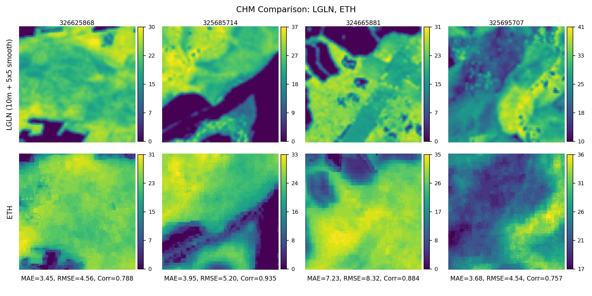
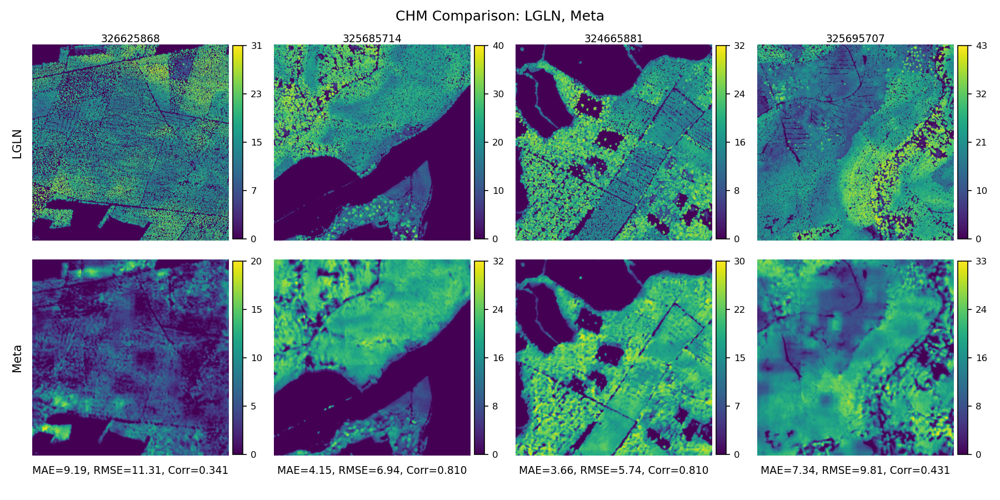

# Data Processing for TreeSatAI & Generation of CHM

> **TL;DR:** Scripts that generate CHM from official elevation data (DTM/DSM)
> to extend TreeSatAI for multitask learning, handle data alignment issues
> and CHM noise, and produce ready‑to‑use Sentinel‑1 + CHM NumPy tensors
> for deep learning.

- **`gen-chm/`** – CHM generation from LGLN DTM/DSM and stacking with S1.
- **`preprocessing/`** – label filtering, stratified splits, class weights,
  and NumPy training arrays (+ basic visualizations).

If you are reading the thesis: this is the implementation behind
**Chapter 4**.

<p>


</p>

## 1. What this does

- Figures out which 1 m LGLN **DGM1/DOM1** tiles overlap each TreeSatAI cell
  (60 m / 200 m).
- Downloads the needed **DTM/DSM** tiles from the LGLN services.
- Builds a **canopy height model (CHM = DSM − DTM)**, fixes simple nodata
  issues, and, for each TreeSat cell, clips CHM values to `[0.0, 41.5983]`,
  applies a **20×20 maximum filter** on the native 1 m grid, and reprojects to
  the TreeSat Sentinel‑1 grid using **bilinear** resampling.
- Reprojects CHM to match Sentinel‑1 resolution and **stacks**
  `[VV, VH, VV/VH, CHM]` into 4‑channel image patches.
- Cleans up TreeSatAI labels with a simple **area threshold**, keeps the
  official TreeSat **9:1 train/test split**, and then creates a stratified
  **8:1:1 train/val/test** split by adding a validation split *inside* the
  original train set.
- Computes **class weights** to help with long‑tail species.
- Saves everything as plain **NumPy arrays** (`train_x.npy`, `train_y.npy`,
  …).

## 2. Inputs & outputs

**Key inputs (under `data/`):**

- `data/lgln-opengeodata/lgln-opengeodata-dgm1.geojson` – DTM footprint index.
- `data/lgln-opengeodata/lgln-opengeodata-dom1.geojson` – DSM footprint index.
- `data/treesat_ori/geojson/bb_60m.GeoJSON`, `bb_200m.GeoJSON` – TreeSatAI grids.
- `data/treesatai_data/s1/60m`, `data/treesatai_data/s1/200m` – Sentinel‑1 VV/VH
  patches on the TreeSat grid.

**TreeSat‑specific inputs (under `@data/treesatai_data/`):**

- `labels/TreeSatBA_v9_60m_multi_labels.json` – multi‑label file (copied from
  the TreeSatAI archive).
- `train_filenames.lst`, `test_filenames.lst` – official TreeSat train/test
  split (≈9:1) used as a fixed base for our 8:1:1 split.

**Key outputs:**

- `@data-processing/dtm-dsm-treesat-links/*.json` – tile↔TreeSat links
  (used for coverage statistics and CHM mosaic decisions).
- `data/dtm1_tif/`, `data/dsm1_tif/` – downloaded DTM/DSM tiles.
- `data/chm_standard/` – 1 m CHM tiles (DSM−DTM per LGLN tile).
- `data/chm_60m/` – CHM reprojected to the TreeSat 60 m grid after clipping to
  `[0.0, 41.5983]`, 20×20 max filtering at 1 m, and bilinear resampling.
- `data/stacked_treesat_60m/` – 4‑band S1+CHM GeoTIFF patches
  `[VV, VH, VV/VH, CHM]`.
- `@data/treesatai_data/s1_60m_stratified/` – filtered labels, stratified
  train/val/test splits, `classes.json`, and `class_weights.json`.
- `@data/training-data-60m/` – final training tensors:
  - `train_x.npy`, `val_x.npy`, `test_x.npy`: `(N, 4, H, W)`
  - `train_y.npy`, `val_y.npy`, `test_y.npy`: `(N, C)` multi‑hot
  - `classes.npy`, `*_filenames.npy`

## 3. How to run the pipelines
### 3.1 CHM generation (`gen-chm`)

```bash
cd @data-processing/gen-chm

# 1) Build DTM/DSM ↔ TreeSat links (per resolution)
python gen1_get_dtm_dsm_treesat_links.py --type dtm --resolution 60
python gen1_get_dtm_dsm_treesat_links.py --type dsm --resolution 60

# 2) Reverse mapping (TreeSat -> {tile_ids})
python gen2_reverse_mapping.py --resolution 60

# 3) Download DTM/DSM tiles from LGLN
python gen3_download_dtm_dsm_tiles.py --types dtm dsm

# 4) Generate 1 m CHM tiles (DSM − DTM)
python gen4_generate_chm.py \
  --dsm-dir ../../data/dsm1_tif \
  --dtm-dir ../../data/dtm1_tif \
  --out-dir ../../data/chm_standard

# 5) Reproject + filter + stack S1+CHM
python gen5_chm_reproj_maxpool_crop_stack.py --resolution 60 --stack
```

### 3.2 Preprocessing & training tensors (`preprocessing`)

```bash
cd @data-processing/preprocessing

# Labels -> keep TreeSat train/test, add stratified val inside train
#        -> class weights -> NumPy arrays
python run_all_preprocessing.py --resolution 60

python vis.py
```

The preprocessing step writes all training arrays into
`@data/training-data-60m/` and saves diagnostic plots under
`plots/training-data-insight/`.

## 4. Links
- **LGLN DTM/DSM (DGM1/DOM1, Lower Saxony)**  
  https://www.lgln.niedersachsen.de/startseite/geodaten_karten/3d_geobasisdaten/dgm/digitale-gelandemodelle-dgm-143150.html
- **ETH Global Canopy Height 2020 (10 m)**  
  https://langnico.github.io/globalcanopyheight/
- **Meta & WRI 1 m Global Canopy Height**  
  https://sustainability.atmeta.com/blog/2024/04/22/using-artificial-intelligence-to-map-the-earths-forests/
- **TreeSatAI Benchmark Archive**  
  https://essd.copernicus.org/articles/15/681/2023/

