# 3. Methodology

This chapter describes the methods used in this thesis, covering dataset construction, model architectures, and experimental design. The thesis investigates multitask learning (MTL) for SAR-based forest monitoring using two different datasets to address data limitations mentioned in the previous chapter. Section 3.1 presents the TreeSatAI-CHM dataset, which extends the existing TreeSatAI benchmark with canopy height labels derived from German LiDAR data. Section 3.2 describes the model architectures developed for this dataset. Section 3.3 presents the iMAESTRO dataset, which provides synthetic forest data. Section 3.4 describes the model architectures for this dataset, which integrate allometric constraints into the multitask learning framework.

## 3.1 TreeSatAI-CHM Dataset

The TreeSatAI benchmark provides Sentinel-1 imagery with species labels for German forests. The study area covers Lower Saxony, Germany, including 50,381 image patches at 60 m spatial extent. The benchmark covers 20 European tree species grouped into 15 tree genera, with species labels from forest administration records. TreeSatAI uses a spatially distributed sampling strategy across Lower Saxony, capturing diverse tree species across different forest types. For this thesis, only the Sentinel-1 component is used to investigate SAR-only multitask learning.

Each Sentinel-1 patch is provided at 10 m resolution and contains two polarization channels and a polarimetric index: VV (co-polarized), VH (cross-polarized), and the VV/VH ratio. The resulting three-band SAR input captures both backscatter intensity and polarimetric contrast.

The dataset construction proceeds in two stages. First, a canopy height model (CHM) is generated from digital terrain and surface models and aligned to the TreeSatAI patch grid. Second, the resulting height data is combined with Sentinel-1 backscatter bands, labels are filtered and split into training, validation, and test sets, and the complete dataset is exported as NumPy arrays suitable for deep learning.

### 3.1.1 Canopy Height Model Generation

#### 3.1.1.1 Elevation Data Sources

For canopy height derivation, the elevation data comes from the Lower Saxony State Office for Geoinformation and Land Surveying (LGLN). The LGLN provides two products relevant to CHM derivation:

- **DTM (Digital Terrain Model, DGM in German)**: A 1 m resolution model of bare-earth elevation, derived from airborne LiDAR surveys conducted across Lower Saxony. The DTM represents ground surface elevation with vegetation and buildings removed through point cloud classification and filtering. The product is generated from multiple LiDAR acquisition campaigns and undergoes quality control procedures to ensure consistent vertical accuracy across the coverage area. The data is distributed in the ETRS89/UTM zone 32N coordinate reference system (EPSG:25832) with elevation values referenced to the German height reference system DHHN2016.

- **DSM (Digital Surface Model, DOM in German)**: A 1 m resolution model of the top surface, including trees, buildings, and other above-ground objects. The DSM is derived from the same LiDAR point clouds as the DTM, but uses first-return pulses to capture the uppermost surface rather than ground-classified returns. This product preserves the canopy top structure and is particularly suitable for forestry applications where the highest vegetation points are of interest.

Both products are distributed as tiled GeoTIFF files covering Lower Saxony, with metadata indices in GeoJSON format that specify tile boundaries and download URLs. The tiles follow a regular grid pattern with consistent spatial extent, facilitating automated processing across large areas.

### 3.1.1.2 Generation Procedure

The canopy height model is computed as:

$$\text{CHM} = \text{DSM} - \text{DTM}$$

This standard approach derives vegetation height from paired elevation products. The resulting CHM represents above-ground object height relative to terrain, corresponding to canopy top height for forested areas.

1) **Tile Selection and Download** The LGLN tile index is loaded as a GeoJSON file, and a spatial index is constructed to identify tiles intersecting each TreeSatAI patch. Of 49,573 total tiles, 6,210 intersect with TreeSatAI locations, achieving 100% coverage. Tiles are downloaded via HTTP from the LGLN open data portal.

2) **Nodata Interpolation** Nodata pixels in DTM or DSM propagate to the CHM output. To address this, nodata values are interpolated using iterative neighbourhood averaging. For each nodata pixel, the algorithm examines its eight neighbours and replaces the value with the mean of valid neighbours. This process repeats for five iterations, filling small gaps while preserving spatial structure.

3) **CHM Computation and Quality Control** After interpolation, the CHM is computed by subtracting DTM from DSM. To remove artifacts, negative CHM values are set to zero, and values exceeding the 95th percentile are clipped to that threshold. This removes implausible values from buildings, power lines, or interpolation errors while preserving the main distribution.

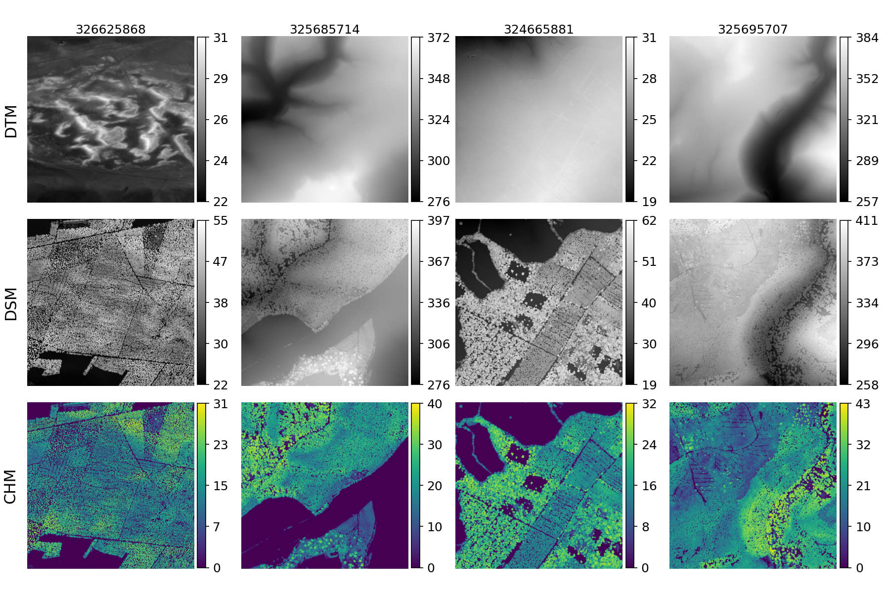

**Figure 3.1: Example DTM, DSM, and CHM tiles for forested areas in Lower Saxony.** The top row shows the Digital Terrain Model (DTM) representing bare-earth elevation, the middle row shows the Digital Surface Model (DSM) capturing the top surface including tree canopies, and the bottom row shows the derived Canopy Height Model (CHM) as the difference between DSM and DTM. Four representative tiles demonstrate the spatial patterns of terrain, surface elevation, and canopy height across different forest types.

4) **Reprojection and Alignment**

The CHM must be reprojected to match TreeSatAI Sentinel-1 geometry. Most patches (87.7%) fall within a single elevation tile, while 12.3% require mosaicking from multiple tiles. For resampling to 10 m resolution, a two-stage approach is used: first, a local maximum filter preserves dominant canopy heights, then bilinear resampling produces smooth fields. This retains local height maxima while avoiding blockiness. Patches with more than 50% nodata are excluded.

5) **Validation Against Global Canopy Height Products**

The derived CHM is validated against two global products: ETH Global Canopy Height (10 m resolution from Sentinel-2 and GEDI LiDAR) and Meta Global Canopy Height (1 m resolution from Maxar imagery and airborne LiDAR). Comparisons use random pixel samples from overlapping areas.

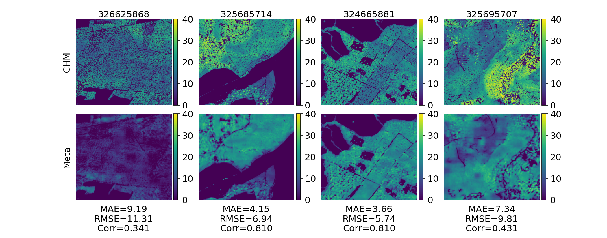
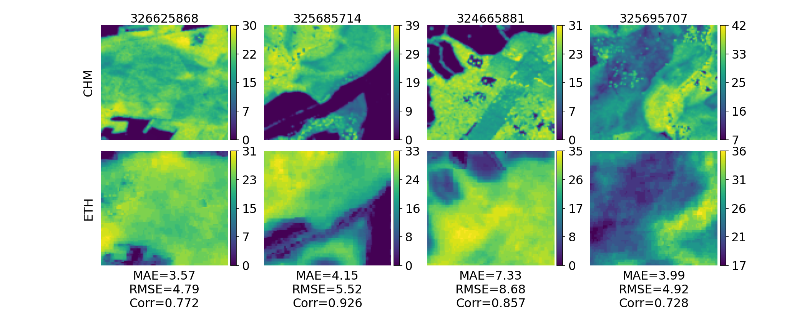

**Figure 3.2: Validation of derived CHM against global canopy height products.** Left: Comparison with Meta Global Canopy Height at 1 m resolution. Right: Comparison with ETH Global Canopy Height at 10 m resolution. Four representative tiles show side-by-side comparisons demonstrating spatial alignment and similar height patterns.

Visual inspection confirms spatial alignment and similar height patterns between the LGLN-derived CHM and global products. The observed differences (several metres RMSE on average) could arise from temporal misalignment, sensor differences, or genuine uncertainty. The global products report 5–10 m RMSE when validated against airborne LiDAR, suggesting the observed discrepancies fall within expected ranges. The LGLN-derived CHM is adopted as the height reference, with the understanding that labels carry inherent uncertainty.

**Figure 3.3 removed and merged with Figure 3.2**

### 3.1.2 Data Preprocessing

#### 3.1.2.1 Assembly of the S1+CHM Dataset

With CHM patches aligned to the TreeSatAI grid, the height data is combined with Sentinel-1 backscatter to create input tensors. For each patch, four input bands are assembled: VV backscatter (dB), VH backscatter (dB), VV/VH ratio, and CHM (metres). The first three bands come from TreeSatAI Sentinel-1 archive, while the fourth is the reprojected CHM. All bands are stacked into a single four-band GeoTIFF per patch.

#### 3.1.2.2 Label Filtering and Data Splitting

Labels are filtered based on area fraction: only genera occupying more than 7% of patch area are retained, corresponding to approximately 250 m² coverage. This removes spurious labels while retaining meaningful species mixtures.

The original TreeSatAI 90%/10% train/test split is retained for benchmark comparability. Within the training portion, stratified sampling creates a validation set, resulting in an 8:1:1 split ratio. For each patch, the primary label (genus with largest area fraction) determines the stratum. Within each stratum, 1/9 of samples are randomly assigned to validation, ensuring all genera are represented in both training and validation splits.

A limitation of this approach is the lack of spatial separation between splits. Spatial autocorrelation may lead to overestimated performance, as nearby samples are more similar than distant ones. However, spatially blocked splits are challenging for TreeSatAI data due to the distributed sampling pattern and would severely reduce training data for rare genera.

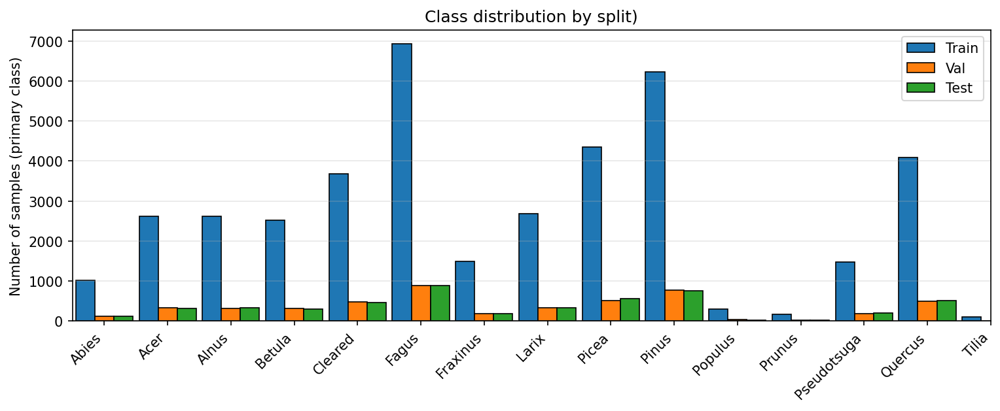

**Figure 3.4: Distribution of patches across genera for training, validation, and test splits.** The bar chart shows patch counts for each genus across the three splits. Picea and Pinus dominate the dataset, while several genera have fewer than 1000 patches. The stratified sampling preserves class proportions across splits, ensuring all genera are represented in training, validation, and test sets.

#### 3.1.2.3 Class Weighting and Data Export

Tree species distributions are naturally imbalanced, with common genera like Picea and Pinus dominating the dataset. To address this, inverse frequency weighting is adopted. For a dataset with $N$ total samples and $n_c$ samples of class $c$, the weight is:

$$w_c = \frac{N}{C \times n_c}$$

where $C$ is the number of classes. This assigns higher importance to rare classes during training.

The final preprocessing converts GeoTIFF stacks and labels into arrays for deep learning. For each split, four-band patches are stacked into tensors of shape $(N, 4, 6, 6)$. Labels are converted to multi-hot vectors. The resulting arrays, class weights, and genus mappings are stored for model training.

### 3.1.3 Dataset Statistics

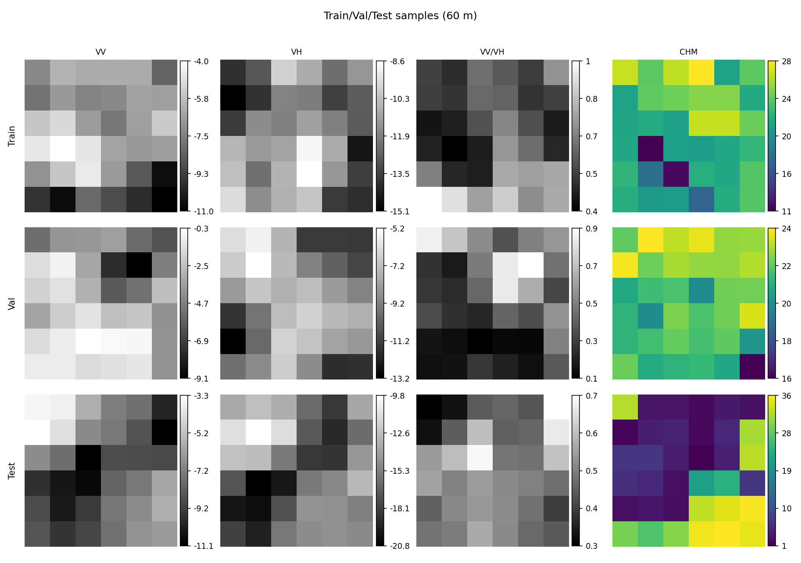

**Figure 3.5: Example patches from training, validation, and test sets.** Each row shows randomly selected patches from one split, with columns displaying the four input bands (VV, VH, VV/VH, CHM). Forest areas show higher VH backscatter and positive CHM values, while clearings show lower backscatter and near-zero CHM.

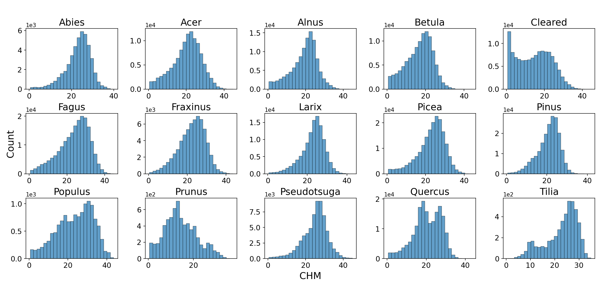

**Figure 3.6: CHM value distributions by genus across all splits.** Each panel shows the CHM histogram for one genus. Different genera exhibit distinct height patterns: coniferous genera like Picea and Pinus show taller canopies, while some broadleaf genera show lower average heights.

## 3.2 Model Architectures for TreeSatAI-CHM

This section describes the model architectures developed for the TreeSatAI-CHM dataset. Two categories of baseline models are used to establish reference performance: multilayer perceptrons (MLPs) following the original TreeSatAI benchmark, and U-Net architectures suitable for extension to multitask learning.

### 3.2.1 Baseline Models

#### 3.2.1.1 Multilayer Perceptron Baseline

The MLP baseline follows the TreeSatAI benchmark architecture to ensure comparability with published results. For the small patch sizes (6 × 6 pixels), MLPs provide a simple baseline that treats each patch as a feature vector. The classification MLP receives the flattened input tensor (3 channels × 6 × 6 = 108 features) and processes it through three hidden layers of 512 units each before producing class logits for 15 genera. Each hidden layer follows the pattern Linear → BatchNorm → ReLU → Dropout. The output layer produces raw logits passed through a sigmoid function for multi-label classification, with a threshold of 0.5 applied to convert probabilities to binary predictions.

The regression MLP shares the same hidden layer structure but outputs a vector of length 36, reshaped to a spatial map of shape (1, 6, 6). To ensure non-negative height predictions, the output passes through a softplus activation function: $\text{softplus}(x) = \log(1 + \exp(x))$.

#### 3.2.1.2 U-Net Baseline

The U-Net architecture uses skip connections between encoder and decoder stages to preserve spatial information during downsampling. For the small patch sizes (6 × 6 pixels), standard U-Net architectures with multiple downsampling stages would eliminate spatial structure. The encoder therefore uses only two downsampling stages, reducing the input from 6 × 6 to 3 × 3, then to a 1 × 1 bottleneck. This minimal depth preserves spatial structure while allowing abstract representations.

The U-Net implementation uses three building blocks: DoubleConv blocks apply two consecutive 3 × 3 convolutions with batch normalization and ReLU activation. Down blocks use strided convolutions for learnable downsampling. Up blocks use transposed convolutions for upsampling, concatenating features with corresponding encoder skip connections.

For classification, the U-Net follows the encoder pathway to extract hierarchical features. After the bottleneck, the decoder reconstructs a feature map at original resolution, and a 1 × 1 convolution produces per-pixel class activations. Global average pooling across spatial dimensions yields patch-level logits for 15 genera. Dropout is applied after the first upsampling stage.

For regression, the U-Net requires full spatial output. The encoder progressively compresses spatial dimensions (6×6 → 3×3 → 1×1) while expanding feature depth (3 → B → 2B → 4B channels, where B is the base channel count). The decoder mirrors the encoder, restoring spatial resolution through skip connections. The concatenation at each decoder stage combines contextual information from deeper layers with high-resolution spatial details from the encoder. A final 1 × 1 convolution produces a single-channel output of shape (1, 6, 6), passed through softplus activation to ensure non-negative height predictions.

**Design Rationale for Multitask Extension**

The baseline models are designed with multitask learning extension in mind. The U-Net architecture is particularly suitable for this purpose because the encoder naturally provides shared representations that can serve multiple decoder heads. In subsequent experiments, a multitask U-Net variant shares the encoder while maintaining separate classification and regression decoders, as illustrated in Figure 3.X.

[Figure 3.X: Multitask U-Net architecture (for reference). The shared encoder feeds into two separate decoder branches: one for species classification and one for canopy height regression. Skip connections are duplicated for each decoder.]

The shared encoder design follows the hard parameter sharing paradigm, which has been shown to provide effective regularisation by forcing the encoder to learn representations useful for multiple tasks (Ruder, 2017; Vandenhende et al., 2021). This architectural choice establishes a foundation for investigating whether joint training on classification and regression improves performance compared to the single-task baselines described in this section.

### 3.2.2 Multitask Learning Architecture

The multitask architecture follows the hard parameter sharing paradigm, where a shared encoder extracts common feature representations processed by task-specific decoder heads. This provides implicit regularization by constraining the encoder to learn representations useful for multiple objectives.

The MultiTaskUNet extends the U-Net regressor baseline with an additional classification head. The shared encoder processes input through two downsampling stages (6×6 → 3×3 → 1×1). The classification head applies global average pooling on bottleneck features, producing a vector passed through a fully connected layer to generate class logits. The regression decoder uses transposed convolutions and skip connections to restore spatial resolution (1×1 → 3×3 → 6×6), with a final 1×1 convolution producing single-channel height predictions through softplus activation. This design allows classification to derive features from the abstract bottleneck representation while regression benefits from the full encoder-decoder pathway with spatial detail preservation.

**Loss Function Design**

Training a multitask model requires combining multiple loss functions. The classification and regression tasks produce losses with different scales: binary cross-entropy for classification and RMSE for regression. To address this, individual task losses are normalized by their running means computed across batches:

$$\tilde{L}_{cls} = \frac{L_{cls}}{\bar{L}_{cls}}, \quad \tilde{L}_{reg} = \frac{L_{reg}}{\bar{L}_{reg}}$$

Two approaches are used for combining losses. Fixed weight combination uses:

$$L_{total} = w_{cls} \cdot \tilde{L}_{cls} + w_{reg} \cdot \tilde{L}_{reg}$$

Alternatively, uncertainty-based weighting learns task weights automatically by modeling homoscedastic uncertainty:

$$L_{total} = \frac{1}{2} e^{-s_{cls}} \cdot \tilde{L}_{cls} + \frac{1}{2} s_{cls} + \frac{1}{2} e^{-s_{reg}} \cdot \tilde{L}_{reg} + \frac{1}{2} s_{reg}$$

where $s_{cls}$ and $s_{reg}$ are learnable log-variance parameters. The exponential terms act as adaptive weights, while the regularization terms prevent excessive uncertainty inflation.

**Gradient Analysis**

Gradient cosine similarity analysis monitors task compatibility. At each encoder layer, gradients from classification and regression losses are computed separately:

$$\cos(\theta_{layer}) = \frac{\nabla_{\theta_{layer}} L_{cls} \cdot \nabla_{\theta_{layer}} L_{reg}}{\|\nabla_{\theta_{layer}} L_{cls}\| \cdot \|\nabla_{\theta_{layer}} L_{reg}\|}$$

Positive similarity indicates compatible learning objectives, while negative similarity indicates gradient conflict. This analysis is performed at three encoder locations to monitor whether tasks converge toward shared representations or compete for encoder capacity.

## 3.3 iMAESTRO Dataset

The iMAESTRO dataset provides synthetic virtual forest landscapes combining field inventory data, vegetation maps, and Airborne Laser Scanning measurements. The dataset covers three European forest regions: Bauges (France), Milicz (Poland), and Sneznik (Slovenia), spanning over 100,000 hectares with approximately 42 million individual trees from 51 species. All structural data are organized on a 25-meter grid resolution, where each cell represents 0.0625 hectares.

The raw data for each site consists of tree-level CSV files containing individual tree attributes (cell identifier, species name, tree count, diameter at breast height, and tree height) and raster files encoding cell identifiers.

### 3.3.1 Processing Raw iMAESTRO Data

#### 3.3.1.1 Biomass Estimation Using Allometric Equations

Individual tree biomass was estimated using species-specific allometric equations:

$$\text{Biomass (kg)} = a \times \text{DBH}^b \times \text{wood\_density}$$

where $a$ and $b$ are species-specific allometric coefficients, DBH is diameter at breast height (cm), and wood_density is in g/cm³. Parameters were compiled from published literature for 52 European temperate forest species. For species without available parameters, default values were applied ($a = 0.0673$, $b = 2.5$, wood_density $= 0.55$ g/cm³).

#### 3.3.1.2 Cell-Level Aggregation

Data were aggregated to the 25-meter grid cell level. For each cell, total biomass was computed by summing individual tree biomass weighted by count, then converted to metric tons per hectare (t/ha). Height statistics used the 95th percentile (height95) as the primary canopy height metric, which is less sensitive to outliers while capturing dominant canopy structure. Species composition was determined by identifying the dominant genus (highest tree count) within each cell, reducing 51 species to 31 genus-level categories.

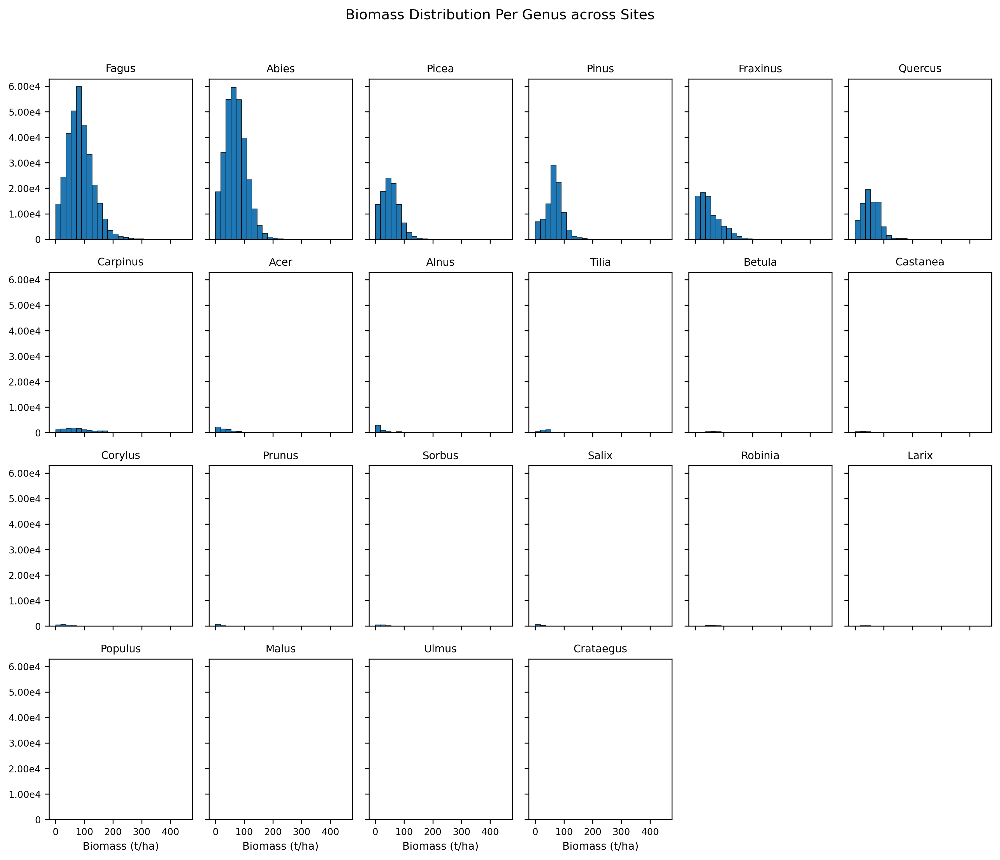
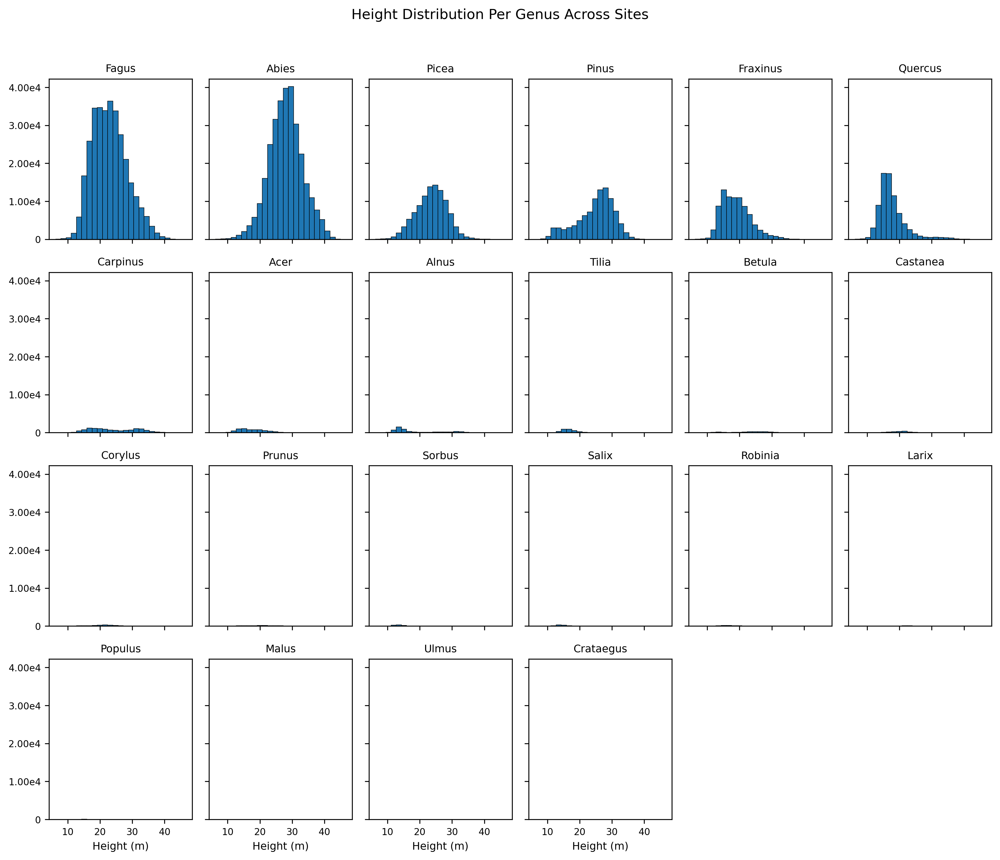

**Figure 3.7: Distribution of biomass and height values by genus across all three sites.** Left: Biomass distributions. Right: Height distributions. Fagus and Abies dominate the dataset with distinct characteristics. Coniferous genera generally show higher biomass values relative to height due to higher wood density.

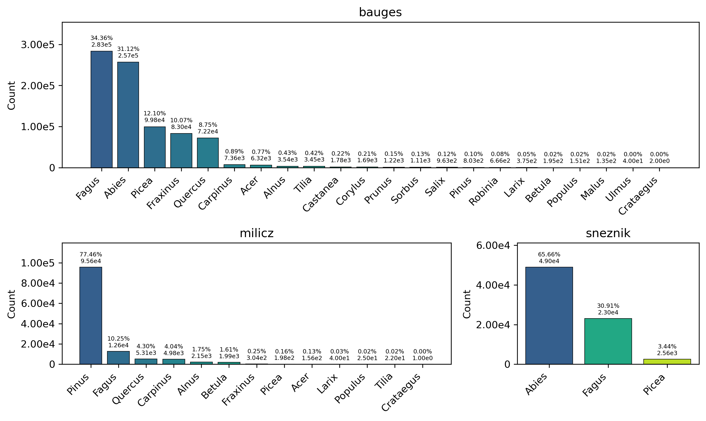

**Figure 3.8: Overall genus distribution in the iMAESTRO dataset.** Bar chart shows the total number of cells for each genus across all three study sites. Fagus and Abies are the most abundant genera.

#### 3.3.1.3 Raster Generation

Cell-level statistics were converted to spatially explicit GeoTIFF rasters: biomass (t/ha), height95 (m), and dominant genus (numerical code). The raster transformation used site-specific coordinate reference systems with consistent 25-meter pixel size.

#### 3.3.1.4 Spatial Smoothing

To reduce spatial discontinuities, different smoothing strategies were applied. For continuous variables (biomass and height95), an edge-preserving filter examined each pixel's 5×5 neighborhood using Median Absolute Deviation (MAD). Only pixels deviating by more than 2 standard deviations were adjusted conservatively. For the categorical genus layer, a majority filter using a 5×5 window replaced each pixel's genus code with the most frequent genus in its neighborhood. Only pixels with valid data were modified, preserving the original spatial extent.

### 3.3.2 Processing Sentinel-1 GRD Data

Sentinel-1 Ground Range Detected (GRD) products were downloaded from the Alaska Satellite Facility. For each site, a single-date acquisition from the 2019 growing season was selected with Interferometric Wide swath mode and dual polarization (VV and VH).

The GRD products were processed using ESA SNAP software. The processing chain applied precise orbit files, radiometric calibration to convert digital numbers to sigma nought backscatter coefficients, and terrain correction using Range-Doppler orthorectification with SRTM 1-arcsecond DEM. Data were reprojected to site-specific coordinate reference systems to match iMAESTRO structural layers.

After terrain correction, SAR backscatter was resampled to the 25-meter grid using bilinear interpolation, ensuring perfect pixel-to-pixel alignment with structural layers.

Calibrated sigma nought values were converted to decibels (dB): $\sigma_{\text{dB}} = 10 \times \log_{10}(\sigma_{\text{linear}})$. Both VV and VH polarization channels were processed and stored as separate GeoTIFF files. Pixels with invalid backscatter values were assigned NoData value of -9999.

### 3.3.3 Preparing Training Data

#### 3.3.3.1 Multi-Channel Data Stacking

For each site, five raster layers were stacked into a single multi-channel array: (0) VH backscatter (dB), (1) VV backscatter (dB), (2) biomass (t/ha), (3) dominant genus (numerical code), and (4) height95 (m). All layers were verified to have identical spatial dimensions and coordinate reference systems. A global valid data mask was computed to identify pixels where all five channels contained valid values, defining the usable extent of each site.

#### 3.3.3.2 Patch Extraction with Spatial Blocking

A spatial blocking strategy was implemented to prevent spatial autocorrelation from inflating performance estimates. Each site was divided into non-overlapping rectangular blocks (4×4 patches per block), and entire blocks were assigned to train, validation, or test sets. With patch size of 64×64 pixels and stride of 32 pixels, each block covered 3.2×3.2 km on the ground. Within each block, patches were extracted using a sliding window with 50% overlap. Patches were retained if at least 20% of pixels contained valid data and the dominant genus channel contained at least one valid pixel.

#### 3.3.3.3 Train-Validation-Test Splitting

Blocks were randomly shuffled and sequentially assigned to train (75%), validation (15%), and test (10%) sets. A fixed random seed (seed = 123) ensured reproducibility. The spatial blocking approach ensured that validation and test sets represented genuinely held-out geographic areas, critical for assessing generalization to new locations.

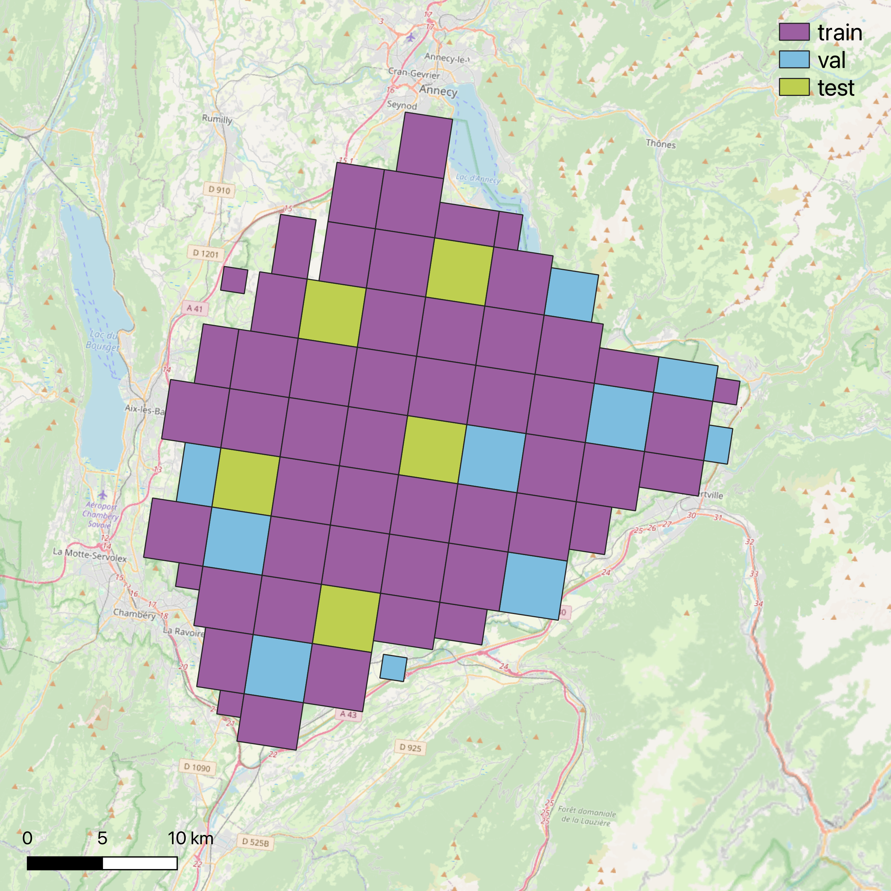
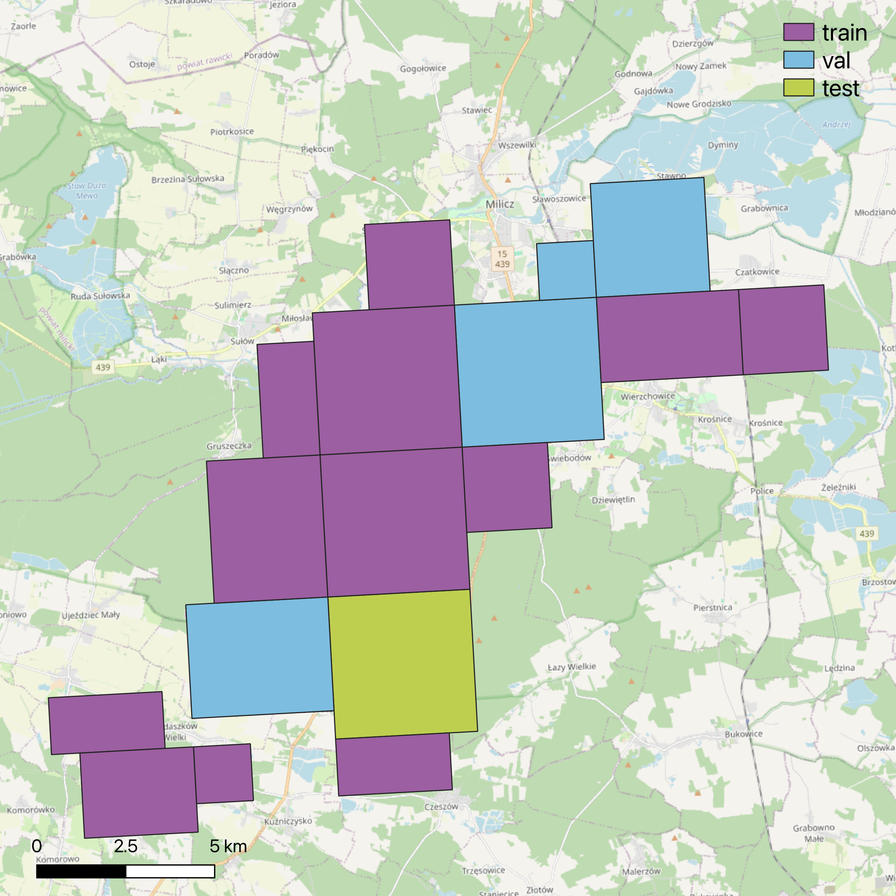
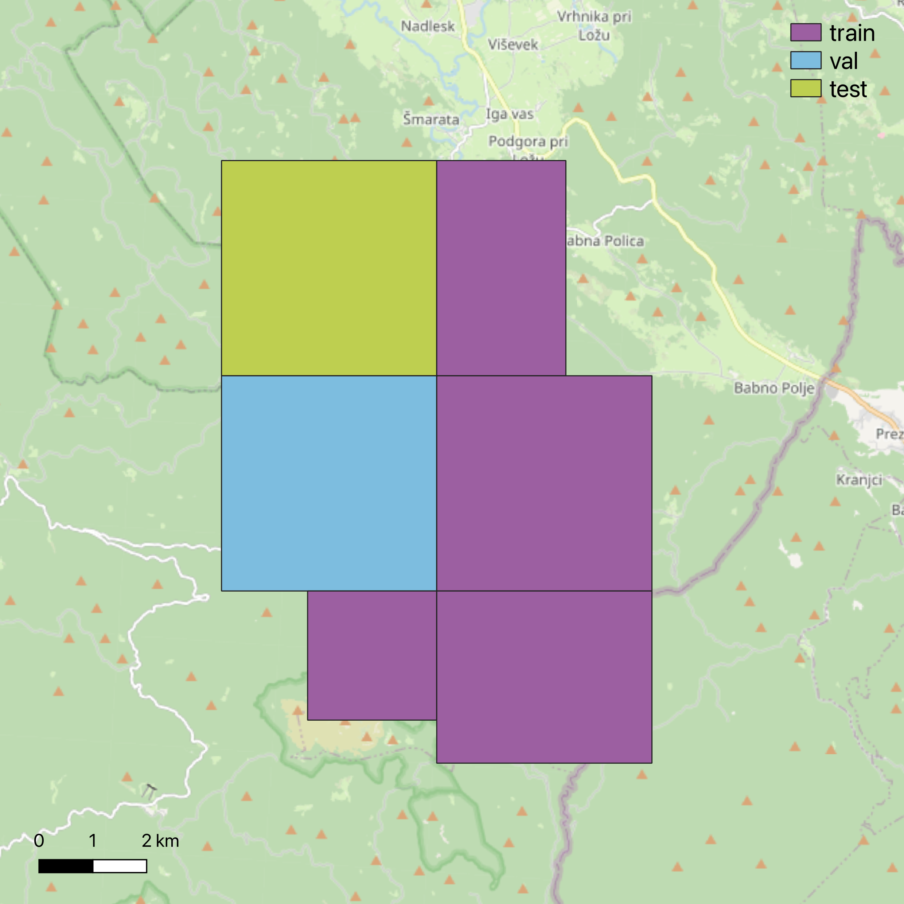

**Figure 3.9: Spatial distribution of training, validation, and test blocks across the three study sites.** Left: Bauges (France), center: Milicz (Poland), right: Sneznik (Slovenia). Purple blocks represent training set (75%), blue blocks validation (15%), and yellow blocks test (10%). The block-based splitting ensures complete spatial separation between splits.

#### 3.3.3.4 Data Export

Final training data were exported as NumPy arrays in .npy format. For each split, three files were created: patches (4D array of shape N×5×64×64), labels_dominant_genus (1D array), and sites (1D array). Biomass and height95 values were embedded in channels 2 and 4 of the patch arrays.

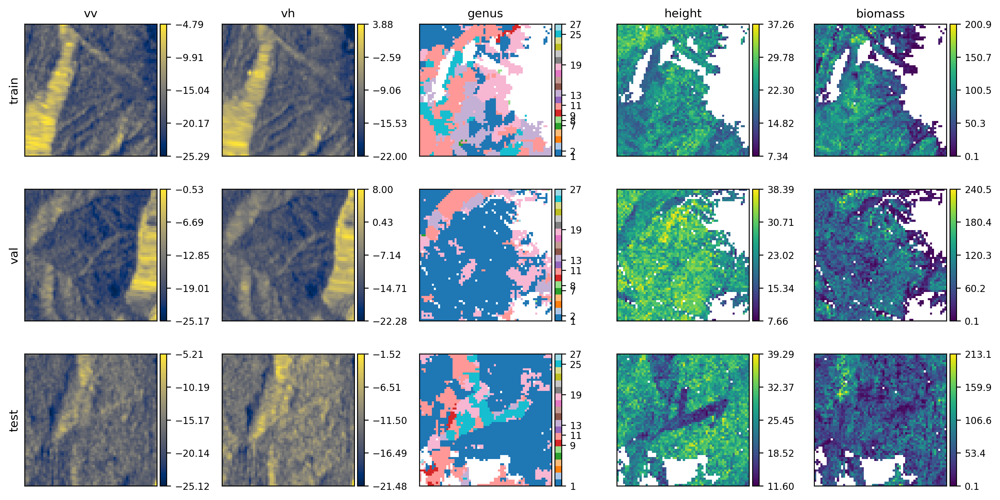

**Figure 3.10: Example training patches from iMAESTRO dataset showing all five channels.** Each row represents one split (train, val, test), with columns showing VV backscatter, VH backscatter, dominant genus, canopy height, and biomass. SAR channels display typical speckle patterns, while height and biomass maps show strong spatial correlation.

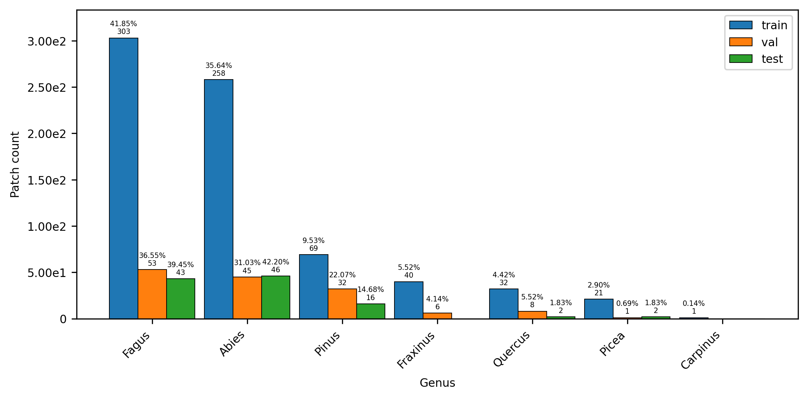

**Figure 3.11: Distribution of dominant genus labels across train, validation, and test splits.** Fagus is the most common genus with over 300 training patches, followed by Abies and Pinus. The proportional distribution is relatively consistent across splits.

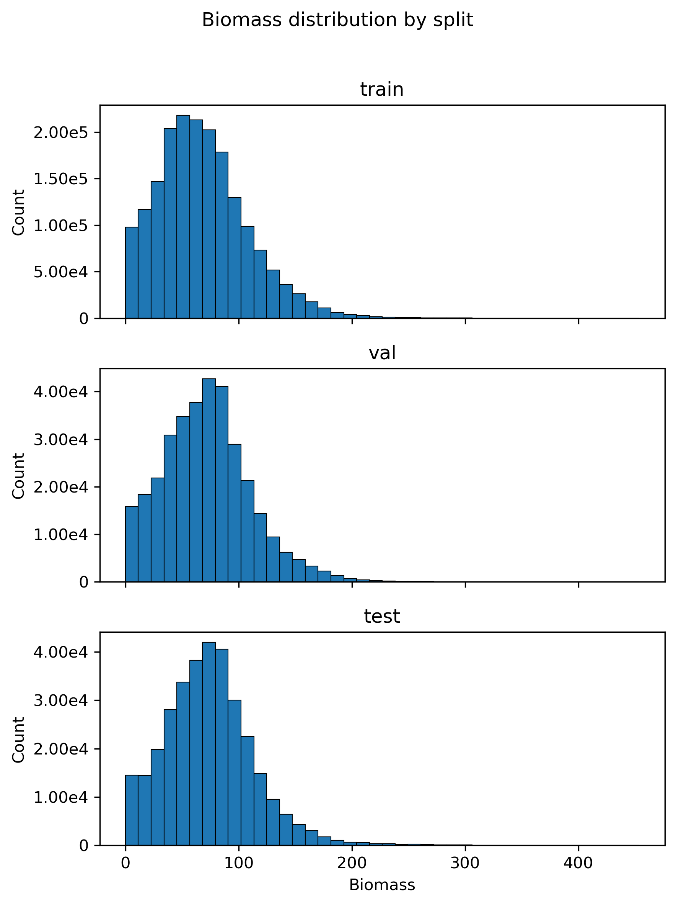
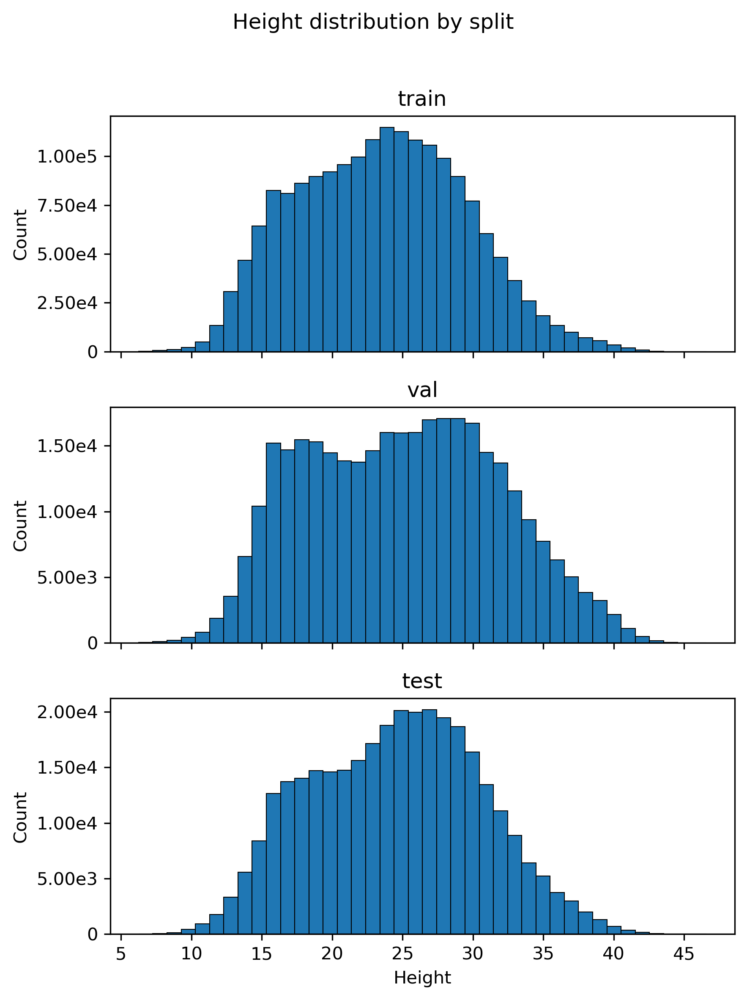

**Figure 3.12: Distribution of biomass and height values across train, validation, and test splits.** Left: Biomass distributions. Right: Height distributions. Both variables exhibit right-skewed distributions typical of forest structural attributes. The similar distribution shapes across splits indicate balanced data splitting.

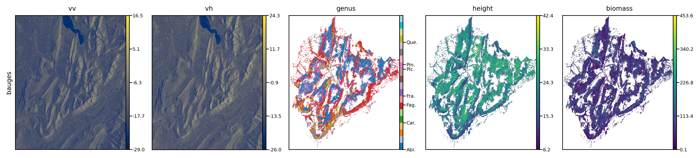

**Figure 3.13: Complete preprocessing outputs for Bauges site (France) showing the five data layers.** From left to right: VV backscatter, VH backscatter, dominant genus, canopy height, and biomass. The site exhibits high structural heterogeneity typical of managed mixed temperate mountain forests.

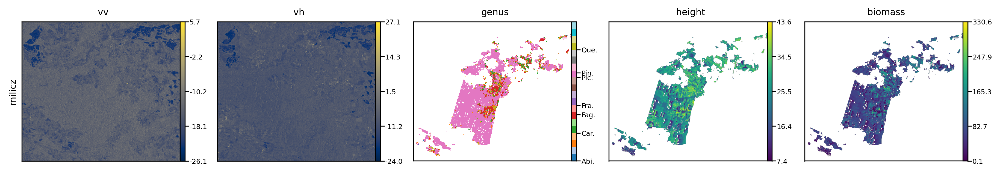

**Figure 3.14: Complete preprocessing outputs for Milicz site (Poland) showing the five data layers.** This lowland forest displays lower SAR backscatter values reflecting flatter topography. Genus composition is dominated by Pinus and Quercus, characteristic of Central European pine-oak forests.

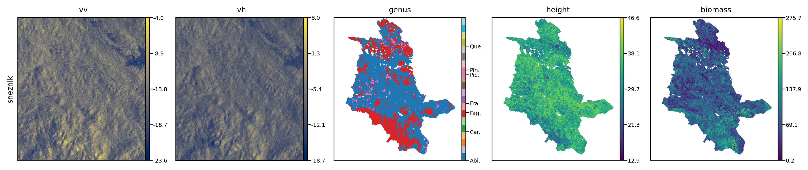

**Figure 3.15: Complete preprocessing outputs for Sneznik site (Slovenia) showing the five data layers.** The mountain forest shows homogeneous composition with Fagus and Abies forming large contiguous patches typical of Dinaric Alps beech-fir forests. This site exhibits the highest structural values among all three.

## 3.4 Model Architectures for iMAESTRO

This section describes the model architectures developed for the iMAESTRO dataset. The models use larger patch sizes (64×64 pixels) compared to TreeSatAI-CHM and integrate physics-based allometric constraints.

### 3.4.1 Single-Task Baseline Models

Three independent U-Net architectures were implemented for genus segmentation, height regression, and biomass regression. The U-Net architecture consists of a contracting encoder path and an expanding decoder path connected by skip connections. The encoder progressively downsamples the input through four stages (64×64 → 32×32 → 16×16 → 8×8 pixels), doubling feature channels at each stage. Each encoder stage applies two 3×3 convolutions with batch normalization and ReLU activation. Downsampling uses strided 3×3 convolutions with stride 2. The decoder mirrors the encoder, upsampling feature maps through transposed convolutions and concatenating them with corresponding encoder features via skip connections. With base channel count C = 128, the encoder produces 128, 256, 512, and 1024 channels at respective resolutions. Spatial dropout (probability 0.2) is applied before the final output layer.

The segmentation model predicts genus labels for each pixel in the 64×64 patch. The decoder outputs 128 channels at full resolution, passed through a 1×1 convolution to produce logits for 22 genus classes. To handle class imbalance, 16 rare genus classes were excluded from training by assigning them an ignore index, allowing the model to concentrate on the six dominant genera. The model was trained using cross-entropy loss.

The height and biomass regression models predict canopy height (height95) and aboveground biomass density (t/ha) for each pixel. Both use the same U-Net architecture with single-channel output through 1×1 convolution. Models were trained using masked RMSE loss, which ignores pixels with invalid target values, ensuring that only valid forest pixels contribute to training.

### 3.4.2 Multi-Task Learning Model

A multi-task U-Net was developed to jointly predict genus segmentation, canopy height, and biomass from Sentinel-1 input. The architecture employs a shared encoder following the same four-stage downsampling structure as baseline models. From the bottleneck, three independent decoder branches reconstruct task-specific predictions at full resolution. Each decoder branch has its own upsampling layers, skip connections, and DoubleConv blocks. The segmentation decoder applies higher dropout (0.4) compared to regression decoders (0.2). Each branch terminates with a 1×1 convolution producing task-specific outputs: 22-class logits for segmentation, and single-channel maps for height and biomass.

The model employs learned uncertainty weighting based on homoscedastic task uncertainty. The total loss is:

$$L_{\text{total}} = \sum_t \frac{1}{2\sigma_t^2} L_t + \frac{1}{2} \log(\sigma_t^2)$$

where $L_t$ is the loss for task $t$ and $\sigma_t$ is a learnable parameter representing task uncertainty. The first term weights each task loss inversely proportional to its uncertainty, while the second term prevents trivially increasing uncertainties. Each task loss is normalized by batch-wise mean loss magnitude before applying uncertainty weighting.

Forest biomass and height are physically related through allometric scaling relationships. An allometric regularization term enforces consistency between predicted height $H$ and biomass $B$ according to: $B = \exp(\alpha) \times H^\beta$. Taking logarithms yields: $\log(B) = \alpha + \beta \times \log(H)$. The allometric loss penalizes deviations:

$$L_{\text{allom}} = \frac{1}{K} \sum (\log(B_k) - \alpha - \beta \times \log(H_k))^2$$

where the sum runs over $K$ valid forest pixels. Parameters $\alpha = 0.0673$ and $\beta = 2.5$ represent average scaling for mixed European forest types. The allometric loss is weighted by $\lambda_{\text{allom}} = 0.0001$ relative to task losses. The final objective combines uncertainty-weighted task losses with the allometric constraint:

$$L_{\text{final}} = L_{\text{total}} + \lambda_{\text{allom}} \times L_{\text{allom}}$$

## References

Ahlswede, S., Schulz, C., Gava, C., Helber, P., Bischke, B., Förster, M., Arias, F., Hees, J., Demir, B., & Kleinschmit, B. (2023). TreeSatAI Benchmark Archive: A multi-sensor, multi-label dataset for tree species classification in remote sensing. *Earth System Science Data*, 15, 681-706.

Antropov, O., Rauste, Y., Häme, T., & Praks, J. (2017). Polarimetric ALOS PALSAR time series in mapping biomass of boreal forests. *Remote Sensing*, 9(10), 999.

Breidenbach, J., Waser, L. T., Debella-Gilo, M., Schumacher, J., Rahlf, J., Hauglin, M., Puliti, S., & Astrup, R. (2021). National mapping and estimation of forest area by dominant tree species using Sentinel-2 data. *Canadian Journal of Forest Research*, 51(3), 365-379.

Caruana, R. (1997). Multitask learning. *Machine Learning*, 28(1), 41-75.

Cenggoro, T. W., et al. (2017). Classification of imbalanced land-use/land-cover data using variational semi-supervised learning. In *2017 International Conference on Innovative and Creative Information Technology (ICITech)*, pp. 1-6. IEEE.

Chave, J., Réjou-Méchain, M., Búrquez, A., Chidumayo, E., Colgan, M. S., Delitti, W. B., Duque, A., Eid, T., Fearnside, P. M., Goodman, R. C., Henry, M., Martínez-Yrízar, A., Mugasha, W. A., Muller-Landau, H. C., Mencuccini, M., Nelson, B. W., Ngomanda, A., Nogueira, E. M., Ortiz-Malavassi, E., ... & Vieilledent, G. (2014). Improved allometric models to estimate the aboveground biomass of tropical trees. *Global Change Biology*, 20(10), 3177-3190.

Chawla, N. V., Bowyer, K. W., Hall, L. O., & Kegelmeyer, W. P. (2002). SMOTE: Synthetic minority over-sampling technique. *Journal of Artificial Intelligence Research*, 16, 321-357.

Cui, Y., Jia, M., Lin, T. Y., Song, Y., & Belongie, S. (2019). Class-balanced loss based on effective number of samples. In *Proceedings of the IEEE/CVF Conference on Computer Vision and Pattern Recognition*, pp. 9268-9277.

Dostálová, A., et al. (2021). European wide forest classification based on Sentinel-1 data. *Remote Sensing*, 13(3), 337.

Dugas, C., et al. (2001). Incorporating second-order functional knowledge for better option pricing. *Advances in Neural Information Processing Systems*, 13, 472-478.

Farr, T. G., Rosen, P. A., Caro, E., Crippen, R., Duren, R., Hensley, S., Kobrick, M., Paller, M., Rodriguez, E., Roth, L., Seal, D., Shaffer, S., Shimada, J., Umland, J., Werner, M., Oskin, M., Burbank, D., & Alsdorf, D. (2007). The Shuttle Radar Topography Mission. *Reviews of Geophysics*, 45(2), RG2004.

Filipponi, F. (2019). Sentinel-1 GRD preprocessing workflow. *Proceedings*, 18(1), 11.

Goodfellow, I., Bengio, Y., & Courville, A. (2016). *Deep Learning*. MIT Press.

He, H., & Garcia, E. A. (2009). Learning from imbalanced data. *IEEE Transactions on Knowledge and Data Engineering*, 21(9), 1263-1284.

Ioffe, S., & Szegedy, C. (2015). Batch normalization: Accelerating deep network training by reducing internal covariate shift. In *International Conference on Machine Learning*, pp. 448-456.

Jenkins, J. C., Chojnacky, D. C., Heath, L. S., & Birdsey, R. A. (2003). National-scale biomass estimators for United States tree species. *Forest Science*, 49(1), 12-35.

Johnson, J. M., & Khoshgoftaar, T. M. (2019). Survey on deep learning with class imbalance. *Journal of Big Data*, 6(1), 27.

Karasiak, N., et al. (2021). Spatial dependence between training and test sets: another pitfall of classification accuracy assessment in remote sensing. *Machine Learning*, 111, 2715-2740.

Kattenborn, T., Leitloff, J., Schiefer, F., & Hinz, S. (2021). Review on Convolutional Neural Networks (CNN) in vegetation remote sensing. *ISPRS Journal of Photogrammetry and Remote Sensing*, 173, 24-49.

Kendall, A., Gal, Y., & Cipolla, R. (2018). Multi-task learning using uncertainty to weigh losses for scene geometry and semantics. In *Proceedings of the IEEE Conference on Computer Vision and Pattern Recognition*, pp. 7482-7491.

Lang, N., et al. (2023). A high-resolution canopy height model of the Earth. *Nature Ecology & Evolution*, 7, 1778-1789.

Larrieu, L., Cabanettes, A., Gonin, P., Lachat, T., Paillet, Y., Winter, S., Bouget, C., & Deconchat, M. (2014). Deadwood and tree microhabitat dynamics in unharvested temperate mountain mixed forests: A life-cycle approach to biodiversity monitoring. *Forest Ecology and Management*, 334, 163-173.

Lee, J. S., & Pottier, E. (2017). *Polarimetric Radar Imaging: From Basics to Applications*. CRC Press.

Lehmann, E. A., Caccetta, P. A., Zhou, Z. S., McNeill, S. J., Wu, X., & Mitchell, A. L. (2015). Joint processing of Landsat and ALOS-PALSAR data for forest mapping and monitoring. *IEEE Transactions on Geoscience and Remote Sensing*, 53(2), 762-779.

Li, Y., Zhang, H., Xue, X., Jiang, Y., & Shen, Q. (2018). Deep learning for remote sensing image classification: A survey. *WIREs Data Mining and Knowledge Discovery*, 8(6), e1264.

Liang, X., et al. (2021). DRSNet: Novel architecture for small patch and low-resolution remote sensing image scene classification. *International Journal of Applied Earth Observation and Geoinformation*, 104, 102841.

Lin, T. Y., Goyal, P., Girshick, R., He, K., & Dollár, P. (2017). Focal loss for dense object detection. In *Proceedings of the IEEE International Conference on Computer Vision*, pp. 2980-2988.

Moudrý, V., et al. (2024). Comparison of three global canopy height maps and their applicability to biodiversity modeling: Accuracy issues revealed. *Ecosphere*, 15(10), e70026.

Mulverhill, C., et al. (2022). Mapping Forest Canopy Height Across Large Areas by Upscaling ALS Estimates with Freely Available Satellite Data. *Remote Sensing*, 14(9), 12563-12587.

Næsset, E. (2002). Predicting forest stand characteristics with airborne scanning laser using a practical two-stage procedure and field data. *Remote Sensing of Environment*, 80(1), 88-99.

Næsset, E., & Gobakken, T. (2008). Estimation of above- and below-ground biomass across regions of the boreal forest zone using airborne laser. *Remote Sensing of Environment*, 112(6), 3079-3090.

Perona, P., & Malik, J. (1990). Scale-space and edge detection using anisotropic diffusion. *IEEE Transactions on Pattern Analysis and Machine Intelligence*, 12(7), 629-639.

Ploton, P., Mortier, F., Réjou-Méchain, M., Barbier, N., Picard, N., Rossi, V., Dormann, C., Cornu, G., Viennois, G., Bayol, N., Lyapustin, A., Gourlet-Fleury, S., & Pélissier, R. (2020). Spatial validation reveals poor predictive performance of large-scale ecological mapping models. *Nature Communications*, 11(1), 4540.

Potapov, P., Li, X., Hernandez-Serna, A., Tyukavina, A., Hansen, M. C., Kommareddy, A., Pickens, A., Turubanova, S., Tang, H., Silva, C. E., Armston, J., Dubayah, R., Blair, J. B., & Hofton, M. (2021). Mapping global forest canopy height through integration of GEDI and Landsat data. *Remote Sensing of Environment*, 253, 112165.

Ridnik, T., Ben-Baruch, E., Zamir, N., Noy, A., Friedman, I., Protter, M., & Zelnik-Manor, L. (2021). Asymmetric loss for multi-label classification. In *Proceedings of the IEEE/CVF International Conference on Computer Vision*, pp. 82-91.

Roberts, D. R., Bahn, V., Ciuti, S., Boyce, M. S., Elith, J., Guillera-Arroita, G., Hauenstein, S., Lahoz-Monfort, J. J., Schröder, B., Thuiller, W., Warton, D. I., Wintle, B. A., Hartig, F., & Dormann, C. F. (2017). Cross-validation strategies for data with temporal, spatial, hierarchical, or phylogenetic structure. *Ecography*, 40(8), 913-929.

Ronneberger, O., Fischer, P., & Brox, T. (2015). U-Net: Convolutional networks for biomedical image segmentation. In *Medical Image Computing and Computer-Assisted Intervention*, pp. 234-241. Springer.

Ruder, S. (2017). An overview of multi-task learning in deep neural networks. *arXiv preprint arXiv:1706.05098*.

Santoro, M., Cartus, O., Carvalhais, N., Rozendaal, D. M. A., Avitabile, V., Araza, A., de Bruin, S., Herold, M., Quegan, S., Rodríguez-Veiga, P., Balzter, H., Carreiras, J., Schepaschenko, D., Korets, M., Shimada, M., Itoh, T., Moreno Martínez, Á., Cavlovic, J., Cazzolla Gatti, R., ... & Willcock, S. (2021). The global forest above-ground biomass pool for 2010 estimated from high-resolution satellite observations. *Earth System Science Data*, 13(8), 3927-3950.

Schindler, K. (2012). An overview and comparison of smooth labeling methods for land-cover classification. *IEEE Transactions on Geoscience and Remote Sensing*, 50(11), 4534-4545.

Shao, G., et al. (2022). High-Resolution Canopy Height Model Generation and Validation Using USGS 3DEP LiDAR Data in Indiana, USA. *Remote Sensing*, 14(4), 935.

Small, D. (2011). Flattening gamma: Radiometric terrain correction for SAR imagery. *IEEE Transactions on Geoscience and Remote Sensing*, 49(8), 3081-3093.

Springenberg, J. T., et al. (2015). Striving for simplicity: The all convolutional net. In *ICLR Workshop*.

Stereńczak, K., et al. (2018). Testing and evaluating different LiDAR-derived canopy height model generation methods for tree height estimation. *International Journal of Applied Earth Observation and Geoinformation*, 71, 132-143.

Stoian, A., et al. (2019). Land cover maps production with high resolution satellite image time series and convolutional neural networks: Adaptations and limits for operational systems. *Remote Sensing*, 11(17), 1986.

Tolan, J., et al. (2024). Very high resolution canopy height maps from RGB imagery using self-supervised vision transformer and convolutional decoder trained on aerial lidar. *Remote Sensing of Environment*, 300, 113888.

Torres, R., Snoeij, P., Geudtner, D., Bibby, D., Davidson, M., Attema, E., Potin, P., Rommen, B., Floury, N., Brown, M., Traver, I. N., Deghaye, P., Duesmann, B., Rosich, B., Miranda, N., Bruno, C., L'Abbate, M., Croci, R., Pietropaolo, A., ... & Rostan, F. (2012). GMES Sentinel-1 mission. *Remote Sensing of Environment*, 120, 9-24.

Vandenhende, S., et al. (2021). Multi-task learning for dense prediction tasks: A survey. *IEEE Transactions on Pattern Analysis and Machine Intelligence*, 44(7), 3614-3633.

Wang, Y., et al. (2023). A deep learning method for optimizing semantic segmentation accuracy of remote sensing images based on improved UNet. *Scientific Reports*, 13, 7600.

Wang, Z., et al. (2024). Scale-aware deep reinforcement learning for high resolution remote sensing imagery classification. *ISPRS Journal of Photogrammetry and Remote Sensing*, 208, 53-73.

West, G. B., Brown, J. H., & Enquist, B. J. (1999). A general model for the structure and allometry of plant vascular systems. *Nature*, 400(6745), 664-667.

Yu, T., Kumar, S., Gupta, A., Levine, S., Hausman, K., & Finn, C. (2020). Gradient surgery for multi-task learning. In *Advances in Neural Information Processing Systems*, 33, 5824-5836.

Zhang, Y., et al. (2025). A deep learning-based solution to the class imbalance problem in high-resolution land cover classification. *Remote Sensing*, 17(11), 1845.

Zianis, D., Muukkonen, P., Mäkipää, R., & Mencuccini, M. (2005). Biomass and stem volume equations for tree species in Europe. *Silva Fennica Monographs*, 4, 1-63.
