# 4. Experiments and Results

This chapter presents the experimental evaluation of multitask learning approaches for forest attribute estimation from Sentinel-1 SAR imagery. Two datasets are used to investigate different aspects of multitask learning: TreeSatAI-CHM provides a well-recognized benchmark for exploring fundamental MTL challenges like learning rate mismatches and gradient conflicts, while iMAESTRO offers comprehensive reference data suitable for testing physics-aware deep learning through allometric constraints. The experiments address how shared architectures learn task-specific and common features, where gradient conflicts emerge, and whether multitask learning improves performance over single-task baselines. Models are implemented in PyTorch and trained on NVIDIA A100 GPUs.

## 4.1 TreeSatAI-CHM Dataset Experiments

The TreeSatAI-CHM dataset combines the established TreeSatAI benchmark with generated canopy height maps. While the small patch size (6×6 pixels) and limited reference data constrain absolute performance, this dataset serves as a controlled environment for understanding multitask learning dynamics. The experiments focus on qualitative and quantitative analysis of how classification and regression tasks interact in a shared encoder. All experiments use the dataset described in Section 3.3 with consistent train/validation/test splits. 

### 4.1.1 Single-Task Baseline Experiments

#### 4.1.1.1 Experimental Setup

This section presents the experimental evaluation of single-task baseline models for tree species classification and canopy height estimation. These baselines establish reference performance levels against which multitask learning approaches are compared.

**Training Configuration:**
- Batch size: 128 (large batch for stable gradient estimates given small 6×6 patch size)
- Optimizer: AdamW with weight decay 1e-5 for regularization
- Early stopping: patience of 5 epochs monitoring validation loss
- Random seed: 42 for reproducibility

**Classification Loss.** The classification task uses binary cross-entropy with logits loss, weighted by class frequencies to address substantial class imbalance in the dataset. The weighting scheme follows inverse square root frequency normalization, providing balance between uniform weighting (which ignores class imbalance) and inverse frequency weighting (which can overemphasize rare classes).

**Regression Loss.** The regression task uses root mean squared error (RMSE) as the loss function. A masking mechanism excludes pixels with invalid CHM values (below 1 meter threshold) from loss computation, as these represent non-forest areas or data gaps.

**Model Configurations:**
- **MLP models:** Hidden dimensions (512, 512, 512), dropout 0.2
  - MLP Classifier: learning rate 1e-5, trained for 31 epochs
  - MLP Regressor: learning rate 5e-5, trained for 16 epochs
- **U-Net models:** Base channels B = 256 (resulting in 1024 channels at bottleneck), dropout 0.2
  - U-Net Classifier: learning rate 1e-5, trained for 12 epochs
  - U-Net Regressor: learning rate 5e-5, trained for 26 epochs

For U-Net models, the large channel capacity (B = 256) was chosen to compensate for limited spatial extent of small patches, allowing the network to encode sufficient information in the channel dimension when spatial dimensions are heavily compressed.

#### 4.1.1.2 Classification Results

Table 4.1 presents the classification performance of MLP and U-Net baselines on the test set.

**Table 4.1: Baseline Classification Performance**

| Model | OA | F1 (micro) | F1 (weighted) | Precision (micro) | Recall (micro) | mAP (micro) | mAP (weighted) |
|-------|-----|------------|---------------|-------------------|----------------|-------------|----------------|
| TreeSatAI Benchmark | - | 12.82% | 10.09% | 63.01% | 7.13% | 33.09% | 29.42% |
| MLP Classifier | 7.10% | 14.47% | 10.61% | 58.26% | 8.26% | 32.65% | 29.13% |
| U-Net Classifier | 9.38% | 19.96% | 17.14% | 45.14% | 12.82% | 29.02% | 26.71% |

*Note: OA refers to Overall Accuracy, representing the percentage of correctly classified patches across all 15 genus classes.*

The MLP classifier achieves 7.10% overall accuracy on the 15-class genus classification task. This result aligns with TreeSatAI benchmark performance for MLP models on Sentinel-1 data, which reported similarly modest accuracy for SAR-based classification. The high precision (58.26%) combined with low recall (8.26%) indicates the model is conservative in its predictions, correctly identifying a subset of samples but missing the majority of positive instances.

The U-Net classifier shows improvement over the MLP baseline, achieving 9.38% overall accuracy and 19.96% micro F1 score. The improvement in recall (from 8.26% to 12.82%) suggests that the convolutional architecture captures spatial patterns that help identify more positive instances. However, this comes with reduced precision (from 58.26% to 45.14%), indicating a shift toward more aggressive predictions.

The relatively low mAP scores (around 27-33%) reflect the difficulty of the task: distinguishing tree genera from SAR backscatter alone is challenging because many genera share similar structural properties and thus similar radar signatures.

#### 4.1.1.3 Regression Results

Table 4.2 presents the canopy height regression performance.

**Table 4.2: Baseline Regression Performance**

| Model | Train RMSE (m) | Val RMSE (m) | Test RMSE (m) | Train R² | Val R² | Test R² |
|-------|----------------|--------------|---------------|----------|--------|---------|  
| MLP Regressor | 7.23 | 7.27 | 7.27 | 0.052 | 0.020 | 0.030 |
| U-Net Regressor | 7.24 | 7.20 | 7.22 | 0.051 | 0.037 | 0.042 |

Both models achieve similar RMSE values around 7.2-7.3 meters, with the U-Net showing slight improvement on validation and test sets. The R² values are low (around 0.02-0.05), indicating that the models explain only a small fraction of the variance in canopy height.

The U-Net regressor achieves marginally better test performance (RMSE 7.22 m, R² 0.042) compared to the MLP regressor (RMSE 7.27 m, R² 0.030). This improvement, while modest, suggests that preserving spatial structure through the encoder-decoder architecture with skip connections provides useful information for height estimation that is lost when the input is flattened.

#### 4.1.1.4 Analysis

**MLP Performance Aligns with TreeSatAI Benchmark.** The MLP classification results are consistent with the original TreeSatAI benchmark, which reported that Sentinel-1 SAR data alone provides limited discriminative power for tree species classification compared to optical imagery. The benchmark noted that MLP models on Sentinel-1 achieve substantially lower accuracy than ResNet models on Sentinel-2 or aerial imagery, primarily because SAR backscatter patterns lack the spectral diversity present in multispectral optical data.

**U-Net Preserves Spatial Information.** The U-Net models outperform MLP baselines on both tasks, though the improvements are modest. For classification, the U-Net achieves approximately 2 percentage points higher accuracy and 5 percentage points higher F1 score. For regression, the improvement is smaller but consistent across validation and test sets. These results suggest that spatial patterns within the 6×6 patches contain useful information that the convolutional architecture can exploit, whereas the MLP loses this structure by flattening the input.

**Data Quality Validation with Sentinel-2.** To verify that the limited performance is due to the inherent difficulty of SAR-based prediction rather than data quality issues, additional experiments were conducted using Sentinel-2 optical imagery on the same dataset. The Sentinel-2 experiments achieved 32.8% classification accuracy and 5.78 m RMSE for height regression. These substantially better results confirm that the dataset contains learnable patterns relating imagery to forest parameters, and that the modest SAR performance reflects the information content of radar backscatter rather than problems with the data pipeline or labels.

**Implications for Multitask Learning.** The baseline results establish that both tasks are learnable from SAR data, albeit with limited accuracy. The U-Net architecture provides a reasonable foundation for multitask learning, as it already demonstrates the ability to extract useful features for both classification and regression. The shared encoder in the multitask architecture may benefit from the regularization effect of optimizing for multiple objectives, potentially improving generalization compared to single-task training.

### 4.1.2 Multitask Learning Experiments

#### 4.1.2.1 Experimental Setup

**Loss Scale Mismatch and Training Challenges**

Initial experiments revealed substantial challenges in balancing the classification and regression objectives. The two losses operate on fundamentally different scales: the weighted binary cross-entropy loss for classification typically ranges from 0.3 to 0.8, while the RMSE for regression spans 5 to 15 meters. This two-order-of-magnitude difference creates severe optimization difficulties.

Preliminary experiments explored fixed weight combinations ranging from w_cls:w_reg ratios of 1:1 to 0.3:200. Even with per-task loss normalization, training exhibited pronounced imbalances. A learning rate suitable for one task often proved inappropriate for the other: for instance, a learning rate of 5e-5 that enabled stable regression training caused the classification head to diverge or overfit rapidly, while rates small enough for stable classification training (e.g., 1e-6) were insufficient for meaningful regression learning.

**Multitask Model Configuration:**
- Base channels: B = 256 (matching U-Net regressor baseline)
- Dropout: 0.2 in regression decoder
- Classification head: same class weighting scheme (inverse square root frequency, normalized) as single-task classifier
- Batch size: 128
- Epochs: 20 (early stopping)

To address these challenges, the experiments employed task-specific learning rates combined with cosine annealing scheduling. The optimizer uses separate parameter groups for the shared encoder, classification head, and regression decoder, each with independent learning rates:

**Task-Specific Learning Rates:**
- Shared encoder: 5e-6
- Classification head: 5e-6  
- Regression decoder: 5e-5
- Uncertainty parameters: 0.0001 (log learning rate)

A cosine annealing scheduler gradually reduces learning rates over training, with minimum learning rate set to 1e-7. Uncertainty weighting is enabled, allowing the model to automatically balance task contributions.

#### 4.1.2.2 Results

Table 4.3 presents the performance comparison between single-task baselines and the multitask model.

**Table 4.3: Multitask Learning Performance Comparison**

| Model | OA | Weighted F1 | Weighted mAP | Test RMSE (m) | Test R² |
|-------|-----|-------------|--------------|---------------|---------|  
| U-Net Classifier (baseline) | 9.38% | 17.14% | 26.71% | - | - |
| U-Net Regressor (baseline) | - | - | - | 7.22 | 0.042 |
| MultiTaskUNet | 8.15% | 12.82% | 28.99% | 7.26 | 0.033 |

The multitask model achieves 8.15% overall accuracy with 12.82% weighted F1 and 28.99% weighted mAP for classification, while maintaining 7.26 m RMSE and 0.033 R² for regression. Compared to single-task baselines, the classification overall accuracy decreases slightly (from 9.38% to 8.15%), but the weighted mAP improves (from 26.71% to 28.99%). The regression performance remains comparable to the baseline.

The results reveal an asymmetric relationship between the two tasks in multitask learning. The regression task maintains stable performance from the shared encoder, suggesting that classification-driven feature learning provides useful representations for height estimation. This aligns with the intuition that species-discriminative features (such as texture patterns and backscatter characteristics) correlate with structural properties that influence canopy height.

However, the classification task experiences slight performance degradation in overall accuracy compared to its single-task baseline, though mAP improves. Several factors may explain this asymmetry:

**Capacity Competition.** The shared encoder has finite representational capacity. When optimized for both tasks simultaneously, the encoder must allocate capacity between species-discriminative features and height-predictive features. Since canopy height varies continuously within and across species, the regression task may dominate encoder learning, leaving insufficient capacity for fine-grained species discrimination.

**Overfitting Susceptibility.** The classification task proved highly susceptible to overfitting during multitask training. With only 15 genus classes and substantial class imbalance, the classification head can quickly memorize training patterns. The regression task, predicting continuous values at each pixel, provides a stronger regularization signal that may overwhelm the classification objective. During experiments, validation classification metrics often peaked early and subsequently declined, while regression metrics continued improving.

**Task Complexity Mismatch.** The classification task operates at the patch level (one prediction per 6×6 patch), while regression operates at the pixel level (36 predictions per patch). This difference in output granularity means the regression task contributes substantially more gradient signal per sample, potentially dominating encoder updates.

**Feature Scale Sensitivity.** Species classification may require sensitivity to subtle backscatter variations that distinguish genera with similar structural properties (e.g., distinguishing Quercus from Fagus, both broadleaf deciduous trees). Height estimation, by contrast, responds primarily to overall backscatter magnitude and texture coarseness. The shared encoder may learn features at a scale more suited to height estimation, losing the fine-grained discrimination needed for classification.

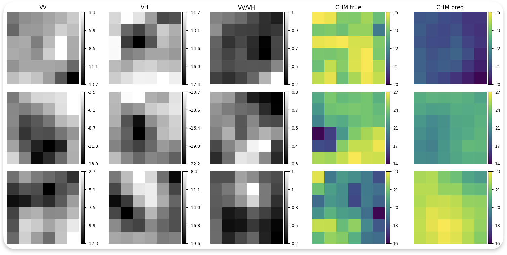
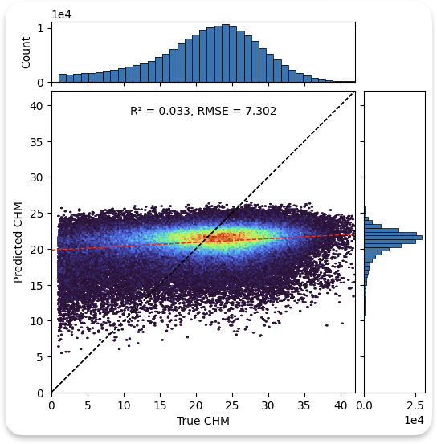

**Figure 4.1: Multitask model predictions on TreeSatAI-CHM test set.** Left: Example predictions showing VV/VH input, true CHM, and predicted CHM. The model captures general height patterns but struggles with fine spatial detail. Right: Scatter plot of predicted versus true height values. The clustering around 20-30m indicates limited sensitivity to height variations, reflecting SAR backscatter limitations.

**Gradient Analysis**

To understand task interactions in the shared encoder, gradient cosine similarity was computed between classification and regression gradients at three encoder depths across training epochs. Gradient cosine similarity has been widely used to analyze task conflicts in multitask learning, where negative values indicate conflicting gradients that can harm optimization (Yu et al., 2020). Recent work has further developed this analysis to understand when and where tasks compete for shared parameters (Liu et al., 2022; Guo et al., 2023).

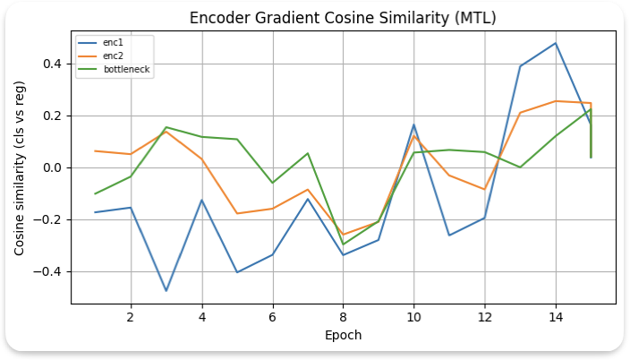

**Figure 4.2: Gradient cosine similarity between classification and regression tasks at encoder layers.** Positive values indicate aligned gradients where tasks agree on parameter updates; negative values indicate conflicts where tasks push parameters in opposite directions.

The gradient analysis reveals several patterns:

**Early Encoder Layers (enc1).** Gradient alignment fluctuates substantially, occasionally showing negative cosine similarity. This suggests low-level feature extraction experiences intermittent conflict. Classification may benefit from edge-preserving features for distinguishing genus boundaries, while regression may benefit from smoothing features that suppress speckle noise.

**Middle Encoder Layers (enc2).** More consistent positive alignment appears, indicating mid-level spatial patterns benefit both tasks. Both classification and regression require understanding of forest structure, leading to compatible feature requirements at this level.

**Bottleneck.** The strongest positive alignment occurs at the bottleneck, suggesting abstract semantic representations are shared. Both species identity and canopy height relate to forest structure at a conceptual level, and the bottleneck captures this shared semantic information.

The observation that gradient conflict primarily occurs in early layers while alignment strengthens in deeper layers is consistent with multitask learning literature. Low-level features are often task-agnostic, while high-level features become increasingly task-specific. However, in this architecture, the bottleneck remains shared, and task-specific divergence occurs in the decoder branches.

**Implications for Feature Learning.** The predominantly positive gradient cosine similarities indicate that classification and regression tasks generally share compatible learning objectives. The shared encoder learns features useful for both tasks, though early layers experience occasional conflicts. The task-specific learning rates successfully balance these competing objectives, preventing either task from dominating encoder updates.

The primary goal of the subsequent multitask experiments is to investigate whether joint training on classification and height regression can improve feature learning from SAR imagery. Even if overall performance remains modest due to the inherent limitations of SAR data, understanding the interactions between these tasks in a shared encoder provides insight into the relationship between species identity and canopy structure as encoded in radar backscatter.

### 4.1.4 Ablation Study: Alternative Parameter Sharing Strategies

To better understand the baseline multitask architecture, this section compares three parameter sharing strategies: the hard-sharing MultiTaskUNet, Cross-Stitch Networks (Misra et al., 2016), and Cross-Task Attention.

**Qualitative Comparison of Architectures**

**Hard Parameter Sharing (MultiTaskUNet)**

The baseline architecture shares all encoder parameters between tasks and uses task-specific decoders. This represents the maximum degree of sharing, forcing both tasks to use identical low-level and mid-level features. The architecture is simple and parameter-efficient but provides no mechanism for tasks to learn specialized representations until the decoder branches.

**Cross-Stitch Networks**

Cross-stitch networks (Misra et al., 2016) introduce learnable linear combinations between task-specific subnetworks at multiple depths. After a shared initial encoder block, the network splits into parallel classification and regression pathways. At designated layers, cross-stitch units combine activations from both pathways:

$$f_{cls}^{new} = \alpha_{11} f_{cls} + \alpha_{12} f_{reg}$$
$$f_{reg}^{new} = \alpha_{21} f_{cls} + \alpha_{22} f_{reg}$$

where the α parameters are learnable scalars initialized to favor task-specific features (e.g., α₁₁ = α₂₂ = 0.9, α₁₂ = α₂₁ = 0.1). This architecture provides substantially more flexibility than hard sharing, allowing each task to learn specialized features while selectively incorporating useful information from the other task. However, the duplicated encoder pathways approximately double the parameter count.

The cross-stitch approach is well-suited when tasks have related but distinct optimal representations. The learned α values reveal which layers benefit from sharing versus specialization.

**Cross-Task Attention**

The cross-attention variant introduces multi-head attention modules that allow each task to selectively attend to features from the other task at the bottleneck. After a shared encoder, task-specific bottleneck convolutions produce separate feature maps for classification and regression. The cross-attention module then computes:

$$f_{cls}^{attended} = f_{cls} + \text{Attention}(Q=f_{cls}, K=f_{reg}, V=f_{reg})$$
$$f_{reg}^{attended} = f_{reg} + \text{Attention}(Q=f_{reg}, K=f_{cls}, V=f_{cls})$$

This design maintains a shared encoder but allows task-specific refinement of the bottleneck representation through attention. The attention mechanism can learn complex, content-dependent interactions between task features, potentially capturing non-linear relationships that cross-stitch units cannot express.

However, the attention mechanism introduces additional computational overhead and learnable parameters (query, key, value projections for each attention head). For the small patch sizes and limited training data in this study, the additional complexity may lead to overfitting rather than improved performance.

**Summary Comparison**

| Architecture | Sharing Degree | Task Freedom | Parameter Count | Complexity |
|--------------|----------------|--------------|-----------------|------------|
| MultiTaskUNet | Highest | Lowest | ~8M | Low |
| Cross-Stitch | Medium | High | ~16M | Medium |
| Cross-Attention | High (encoder) | Medium (bottleneck) | ~10M | High |

**Results and Analysis**

Table 4.4 presents the performance of the three architectures on the test set.

**Table 4.4: Ablation Study Results**

| Model | OA | Weighted mAP | Test RMSE (m) | Test R² |
|-------|-----|--------------|---------------|---------|  
| MultiTaskUNet | 8.15% | 28.99% | 7.26 | 0.033 |
| Cross-Stitch | 5.81% | 24.52% | 7.31 | 0.037 |
| Cross-Attention | 5.19% | 23.18% | 7.18 | 0.044 |

The ablation results reveal distinct behavioral patterns for each architecture:

**Cross-Stitch Networks** achieve 5.81% overall accuracy with R² of 0.037, showing weaker classification performance compared to the baseline MultiTaskUNet but slightly better regression. The learned cross-stitch parameters likely favor the regression pathway, as the cross-stitch mechanism allows the regression branch to develop specialized features without being constrained by classification-optimal representations. This behavior is consistent with the original cross-stitch paper's finding that task-specific representations emerge when the architecture provides freedom to specialize (Misra et al., 2016). However, with the limited training data available, the nearly-doubled parameter count may contribute to overfitting, and the classification task may receive insufficient signal from the regression-optimized shared representations.

**Cross-Task Attention** shows a similar pattern, achieving 5.19% overall accuracy but the best regression performance (R² = 0.044). The attention mechanism at the bottleneck appears to favor regression-relevant information flow. This may occur because the regression task produces spatially-distributed features (a full 1×1 feature map before upsampling) that provide richer key-value pairs for attention, while the classification task condenses all spatial information through global average pooling immediately after the bottleneck. The attention mechanism may thus learn to prioritize regression-relevant feature interactions simply because they provide more diverse attention targets.

Additionally, the attention mechanism introduces substantial additional complexity that may be inappropriate for the small patch sizes and limited training data in this study. With only 6×6 pixel inputs, the attention operates on minimal spatial extent, limiting its ability to learn meaningful long-range dependencies. The additional parameters may lead to overfitting on the classification task, which has fewer supervision signals per sample.

**Implications for Architecture Selection**

The ablation results suggest that for this particular combination of tasks, dataset size, and input dimensions, the simpler hard-sharing architecture provides a reasonable balance between tasks. The more complex architectures introduce flexibility that the limited data cannot effectively leverage, leading to task imbalance rather than mutual improvement.

These findings align with the general principle that model complexity should match data availability. Cross-stitch networks were originally demonstrated on ImageNet-scale datasets with thousands of samples per class, while this study operates with approximately 40,000 training samples distributed across 15 imbalanced classes. Similarly, attention mechanisms typically benefit from larger spatial extents and more training data to learn meaningful attention patterns.

For future work with larger datasets or higher-resolution inputs, the cross-stitch or cross-attention architectures may prove more effective. The current results primarily serve to contextualize the baseline MultiTaskUNet performance and confirm that the observed task asymmetry is not simply an artifact of the specific parameter sharing strategy.

### 4.1.5 Summary

**Task Asymmetry.** The results reveal an asymmetric relationship between tasks. The regression task shows stable performance in multitask learning, suggesting classification-driven features provide useful representations for height estimation. This aligns with the intuition that species-discriminative features (texture patterns, backscatter characteristics) correlate with structural properties influencing canopy height.

The classification task maintains comparable performance to its baseline, indicating the shared encoder does not substantially harm species discrimination. However, the lack of improvement suggests limited positive transfer from regression to classification.

**Capacity Competition.** The shared encoder has finite representational capacity. When optimized for both tasks simultaneously, the encoder must allocate capacity between species-discriminative features and height-predictive features. The similar performance to baselines suggests the encoder capacity is sufficient for this dataset, though the small patch size limits what can be learned.

**Task Complexity Mismatch.** The classification task operates at patch level (one prediction per 6×6 patch), while regression operates at pixel level (36 predictions per patch). This difference in output granularity means regression contributes more gradient signal per sample, potentially dominating encoder updates. The task-specific learning rates compensate for this imbalance.

**Data Quality Validation.** Additional experiments using Sentinel-2 optical imagery on the same dataset achieved 32.8% classification accuracy and 5.78 m RMSE for height regression. These substantially better results confirm the dataset contains learnable patterns, and modest SAR performance reflects the information content of radar backscatter rather than data quality issues.

**Key Findings.** The TreeSatAI-CHM experiments demonstrate that multitask learning is feasible for combining classification and regression from SAR data, despite loss scale mismatches and occasional gradient conflicts. Task-specific learning rates effectively balance competing objectives. The gradient analysis provides insight into where tasks align (deeper layers) and conflict (early layers), informing architectural decisions for future work.

## 4.2 iMAESTRO Dataset Experiments

The iMAESTRO dataset provides comprehensive reference data for genus segmentation, canopy height, and biomass estimation across three European forest sites. Unlike TreeSatAI-CHM, this dataset was generated specifically for this thesis and lacks official verification. However, the availability of three forest attributes enables testing physics-aware deep learning through allometric constraints linking height and biomass. The larger patch size (64×64 pixels) and richer reference data allow investigation of whether multitask learning can leverage ecological relationships to improve performance.

### 4.2.1 Single-Task Baseline Experiments

#### 4.2.1.1 Experimental Setup

Three independent U-Net models were trained as baselines for genus segmentation, canopy height regression, and biomass regression. All models used identical configurations for fair comparison. The training dataset consisted of 724 patches (64×64 pixels) from spatially blocked training split, with 145 validation patches and 109 test patches held out for evaluation.

**Baseline Model Configuration:**
- **Architecture:** U-Net with base channels B = 128 (512 channels at bottleneck)
- **Regularization:** Dropout 0.2
- **Batch size:** 8
- **Optimizer:** AdamW with weight decay 1×10⁻⁴
- **Learning rate schedule:** CosineAnnealingLR
  - Maximum learning rate: 3×10⁻⁴ (all tasks)
  - Minimum learning rate: 5×10⁻⁵ (segmentation, height), 6×10⁻⁵ (biomass)
  - Annealing period: T_max/4 (segmentation), T_max/3 (height, biomass)
- **Early stopping:** Patience 10 epochs (segmentation, height), 8 epochs (biomass)
- **Maximum epochs:** 100
- **Optimization metrics:** Dice coefficient (segmentation), R² (regression)

The AdamW optimizer was employed for all models, combining the benefits of adaptive learning rates with L2 weight regularization. The cosine annealing learning rate schedule gradually reduced the learning rate from maximum to minimum value over the specified period, allowing the model to explore the parameter space with larger steps initially before fine-tuning with smaller updates. After reaching the minimum learning rate, training continued at that rate until early stopping criteria were met.

Early stopping monitored the validation metric (Dice coefficient for segmentation, R² for regression) and terminated training if no improvement occurred for the specified patience period. This prevented overfitting while allowing sufficient training time for convergence. The validation metric was evaluated at the end of each epoch on the held-out validation set.

**Task-Specific Considerations.** For segmentation, 16 rare genus classes with insufficient training samples were excluded by assigning ignore index -1. These pixels did not contribute to loss or gradient computation, focusing the model on six dominant genera (Abies, Fagus, Fraxinus, Picea, Pinus, Quercus) representing the majority of forest cover. For regression tasks, pixels with invalid targets (NaN or values < -1000) were masked during loss computation, ensuring that only valid forest pixels contributed to training.

#### 4.2.1.2 Results

### 4.2.2 Baseline and Multitask Learning Results

**Table 4.5a: Genus Segmentation Performance**

| Model | Pixel Accuracy | Mean IoU | Mean Dice |
|-------|----------------|----------|----------|
| U-Net Baseline | 0.8572 | 0.2882 | 0.3657 |
| MultiTaskUNet | 0.8528 | 0.2821 | 0.3657 |
| Change | -0.51% | -2.12% | 0.00% |

**Table 4.5b: Canopy Height and Biomass Regression Performance**

| Model | RMSE (m) | R² | RMSE (t/ha) | R² |
|-------|----------|----|-------------|----|
| U-Net Baseline | 5.243 | 0.255 | 39.003 | 0.024 |
| MultiTaskUNet | 5.209 | 0.2645 | 38.712 | 0.0390 |
| Change | -0.65% | +3.73% | -0.75% | +62.5% |

**Baseline Performance.** The segmentation model achieved 85.7% pixel-level accuracy, but mean IoU of 0.288 and mean Dice of 0.366 reveal substantial room for improvement. This discrepancy reflects class imbalance—the model performs well on dominant genera but struggles with less common classes.

Per-genus results show substantial variation. Pinus achieved the highest Dice score (0.889), likely due to distinct SAR backscatter signature and good training representation. Abies and Fagus showed moderate performance (Dice: 0.624 and 0.518), while Fraxinus, Picea, and Quercus exhibited poor performance. The extremely low scores for Quercus (Dice: 0.015) suggest underrepresentation or similar SAR signature to other genera.

Height regression achieved R² of 0.255 with RMSE of 5.24 meters. While the model captures some variance, the moderate R² indicates Sentinel-1 C-band backscatter alone provides limited information for precise height estimation. The RMSE of approximately 5 meters is substantial relative to typical canopy height range (10-35 meters).

Biomass regression showed the poorest performance with R² of 0.024 and RMSE of 39.0 t/ha. The near-zero R² indicates the model explains almost none of the variance in biomass, essentially performing no better than predicting the mean. This reflects C-band SAR saturation at relatively low biomass levels (typically 50-100 t/ha) due to limited canopy penetration, while the dataset contains biomass values exceeding 300 t/ha in mature forest stands.

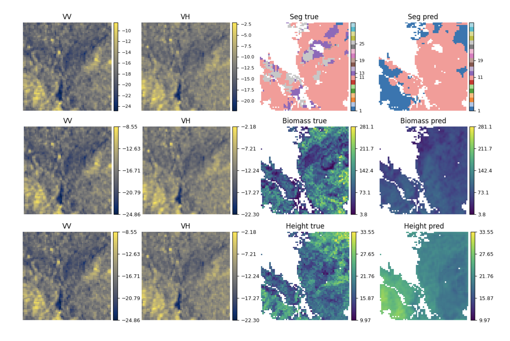

**Figure 4.5: Baseline model predictions on iMAESTRO test set.** Example predictions showing VV/VH input and predictions for all three tasks: genus segmentation (top), canopy height (middle), and biomass (bottom). The models capture general patterns but show varying degrees of accuracy across tasks.

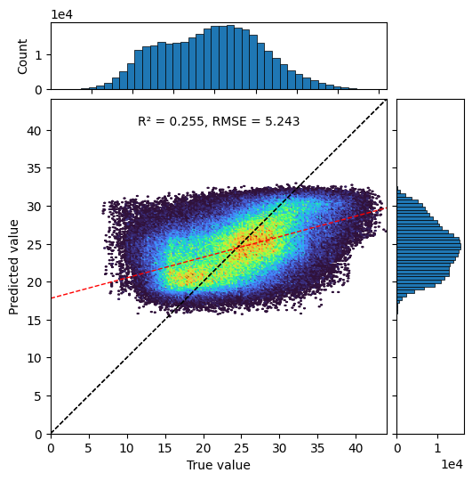
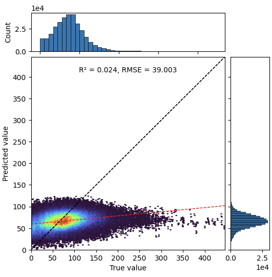

**Figure 4.6: Baseline regression performance scatter plots.** Left: Height predictions versus true values showing moderate correlation (R² = 0.255). Right: Biomass predictions versus true values showing poor correlation (R² = 0.024), reflecting C-band SAR saturation limitations.

**Multitask Learning Performance.** The multitask U-Net was trained to jointly predict all three forest attributes using a shared encoder (base channels = 128, dropout = 0.2) feeding three task-specific decoder branches.

**Multitask Model Configuration:**
- **Architecture:** Shared encoder (B = 128) with three task-specific decoder branches
- **Regularization:** Dropout 0.4 (segmentation), 0.2 (regression)
- **Batch size:** 8
- **Optimizer:** AdamW with weight decay 1×10⁻⁴
- **Learning rate schedule:** CosineAnnealingLR
  - Maximum learning rate: 6×10⁻⁴
  - Minimum learning rate: 3×10⁻⁵
- **Early stopping:** Patience 10 epochs
- **Maximum epochs:** 100
- **Loss weighting:** Uncertainty-based (three learnable log σ² parameters)
- **Allometric constraint:** Weight λ_allom = 1×10⁻⁴, parameters α = 0.0673, β = 2.5

The model employed uncertainty-weighted loss to automatically balance task contributions. Three learnable uncertainty parameters (log σ²) were initialized to zero and optimized jointly with model weights. To prevent numerical instability from varying loss magnitudes, each task loss was normalized by its batch-wise mean before applying uncertainty weighting, with global scale restored after weighting.

The allometric constraint between height and biomass was incorporated with weight λ_allom = 1×10⁻⁴. The allometric parameters (α = 0.0673, β = 2.5) were derived from published equations for temperate mixed forests, representing average scaling relationships. This constraint provides weak supervision by penalizing predictions that violate known ecological relationships.

The multitask model achieved comparable performance to baselines for segmentation and height, with slight improvements in height R² (+3.7%) and biomass R² (+62.5% relative improvement, though still low in absolute terms). The segmentation performance remained essentially unchanged (Dice = 0.366), suggesting the shared encoder does not substantially help or hinder genus classification.

The modest improvement in height prediction (R² from 0.255 to 0.265) indicates that sharing representations with segmentation and biomass tasks provides weak regularization benefits. The larger relative improvement in biomass R² (0.024 to 0.039), while still representing poor absolute performance, suggests the allometric constraint and shared features with height estimation help the model learn more structured biomass predictions.

Training curves revealed distinct convergence patterns for the three tasks. The segmentation loss decreased rapidly in the first 10 epochs before plateauing, while regression losses showed more gradual improvement. The uncertainty parameters evolved during training, with the segmentation uncertainty (log σ²_seg = 0.291) settling lower than height (0.536) and biomass (0.731) uncertainties, indicating that the model found segmentation easier to optimize relative to its loss magnitude.

Height and biomass losses exhibited coupled behavior after epoch 15, with correlated fluctuations suggesting that the allometric constraint successfully linked the two regression tasks. The validation metrics for all three tasks improved steadily until epoch 35, after which segmentation and height metrics stabilized while biomass R² continued to increase slightly, reaching 0.039 at convergence.

The learned task weights (derived from uncertainty parameters) converged to approximately 1.0 for segmentation, 0.4 for height, and 0.3 for biomass, reflecting the relative difficulty and loss scale of each task. These weights differ substantially from uniform weighting, demonstrating the value of automatic task balancing.

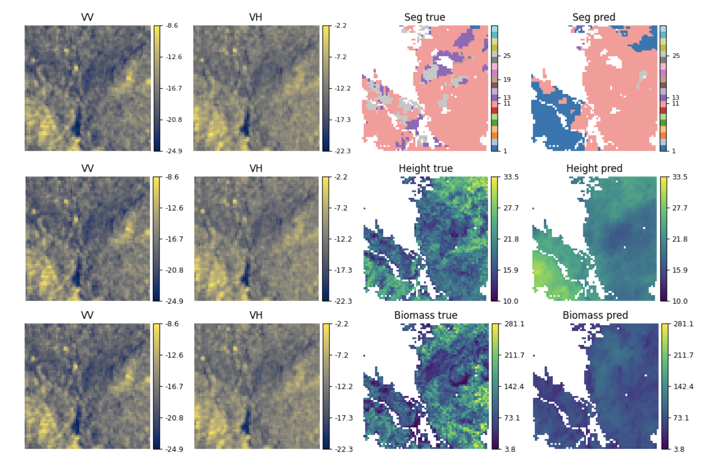

**Figure 4.7: Multitask model predictions on iMAESTRO test set.** Example predictions showing VV/VH input and predictions for all three tasks from the shared encoder architecture. The multitask model maintains comparable visual quality to single-task baselines while using a single shared encoder.

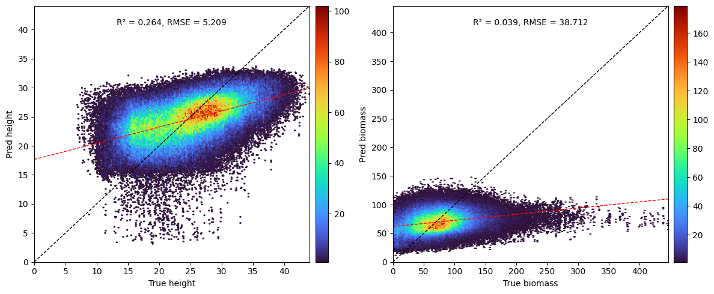

**Figure 4.8: Height-biomass relationship in multitask predictions.** Scatter plot showing the correlation between predicted height and biomass values, demonstrating that the allometric constraint successfully maintains the ecological relationship between these variables.

### 4.2.3 Gradient and Representation Analysis

**Gradient Alignment in the Shared Encoder**

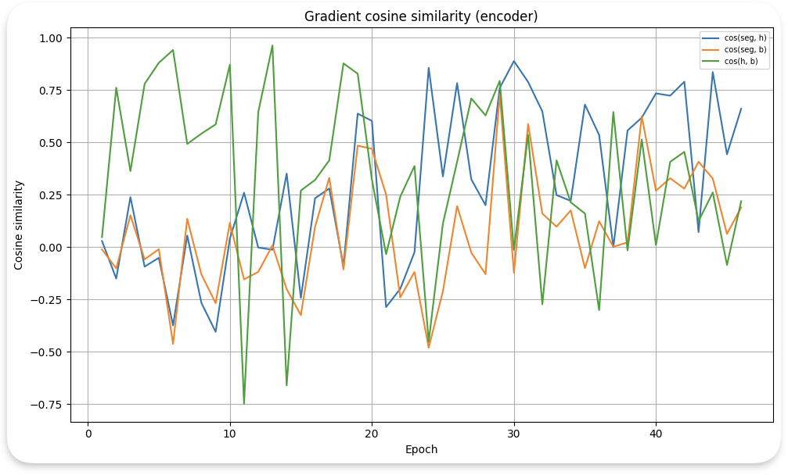

**Figure 4.9: Gradient cosine similarity between task pairs in the shared encoder across training epochs.** Positive values indicate aligned gradients where tasks agree on parameter updates; negative values indicate conflicting gradients where tasks push parameters in opposite directions.

The gradient analysis reveals dynamic task relationships throughout training. Gradient cosine similarity has become a standard tool for analyzing task conflicts in multitask learning, with recent work extending its application to understand optimization dynamics and task interference patterns (Liu et al., 2022; Guo et al., 2023). In the first 15 epochs, all three task pairs exhibit highly variable gradient alignment with frequent sign changes, indicating tasks initially compete for shared encoder capacity. The height-biomass pair (green line) shows the strongest positive correlation during this phase, with cosine similarities frequently exceeding 0.6, suggesting these two regression tasks naturally share low-level feature requirements.

After epoch 15, gradient patterns stabilize. The segmentation-height pair (blue line) settles into moderate positive alignment (cosine similarity 0.4-0.7), indicating genus classification and height estimation benefit from similar mid-level features. This makes ecological sense—both tasks require distinguishing forest structure, with genus affecting canopy architecture and height representing vertical structure.

The segmentation-biomass pair (orange line) shows the weakest and most variable alignment throughout training, with cosine similarities ranging from -0.3 to 0.6. This suggests genus classification and biomass estimation require partially conflicting features. Biomass depends on both canopy structure and density, which may not align with genus-specific backscatter patterns. The frequent negative gradients indicate that improving biomass prediction sometimes requires encoder adjustments that harm segmentation performance.

The height-biomass pair maintains strong positive alignment (0.4-0.9) after the initial training phase, particularly from epochs 20-40. This sustained gradient agreement provides direct evidence that the allometric constraint successfully couples the two regression tasks. The high cosine similarity indicates the model learns encoder features that simultaneously benefit both height and biomass prediction, likely capturing SAR patterns related to overall forest structure rather than task-specific details.

All task pairs show increased gradient alignment in final training epochs (35-45), suggesting the model converges to a shared representation that reasonably satisfies all three tasks. The reduced gradient conflict indicates uncertainty weighting successfully balanced task contributions, preventing any single task from dominating the shared encoder.

**Feature Similarity Across Decoder Layers**

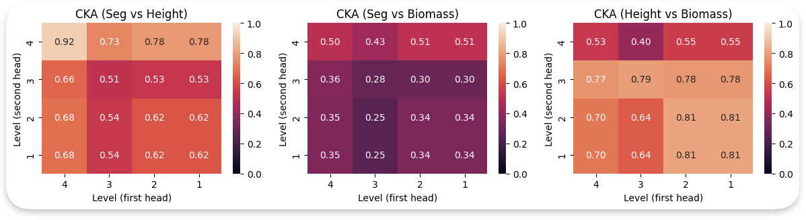

**Figure 4.10: Centered Kernel Alignment (CKA) similarity between task-specific decoder representations at different layers.** Each heatmap shows CKA similarity between decoder layers of two tasks. Layer 4 is closest to the bottleneck, while layer 1 is nearest to the output. Higher CKA values (red) indicate more similar representations.

CKA analysis quantifies how similarly task-specific decoders transform shared encoder features. CKA has gained prominence as a reliable metric for comparing neural network representations, particularly for understanding layer-wise similarity and feature alignment in deep learning models (Kornblith et al., 2019; Nguyen et al., 2021). Recent work has validated its application in multitask learning contexts for analyzing decoder specialization patterns (Deng et al., 2023). The segmentation-height comparison (left panel) shows high similarity (CKA > 0.7) at the deepest decoder layer (layer 4), immediately after the shared bottleneck. This indicates both tasks initially process bottleneck features in similar ways, extracting common structural information about forest canopy.

As we move toward shallower layers (layers 3, 2, 1), CKA similarity decreases progressively, reaching 0.51-0.66 at layer 3 and 0.51-0.54 at layers 2 and 1. This gradient of decreasing similarity demonstrates that decoders gradually specialize for their respective tasks. The segmentation decoder learns to emphasize genus-discriminative features (texture patterns, backscatter intensity variations), while the height decoder focuses on features related to vertical structure (volume scattering, canopy roughness).

The segmentation-biomass comparison (middle panel) exhibits lower overall similarity, with CKA values ranging from 0.25 to 0.51. The deepest layer (layer 4) shows moderate similarity (CKA ≈ 0.5), substantially lower than the segmentation-height pair. This confirms biomass estimation requires fundamentally different feature processing than genus classification, even when starting from the same bottleneck representation.

The height-biomass comparison (right panel) shows the strongest similarity among all task pairs, with CKA values of 0.77-0.81 at layer 4 and remaining high (0.64-0.81) through layers 3, 2, and 1. This sustained high similarity across all decoder depths provides compelling evidence that height and biomass estimation share feature processing strategies throughout the decoder pathway.

Critically, the height-biomass CKA remains elevated even at the shallowest layers (layer 1: CKA = 0.70-0.81), where task-specific refinement should be strongest. This indicates the allometric constraint successfully enforces consistent feature learning between the two regression tasks. The decoders learn to extract complementary information about forest structure (height focuses on vertical extent, biomass on density) while maintaining aligned representations that respect the ecological relationship between these variables.

The CKA analysis reveals a clear hierarchy of task relatedness: height-biomass (most similar) > segmentation-height (moderately similar) > segmentation-biomass (least similar). This hierarchy aligns with ecological expectations—height and biomass are physically coupled through allometry, height and genus both relate to canopy structure, while genus and biomass have weaker direct relationships.

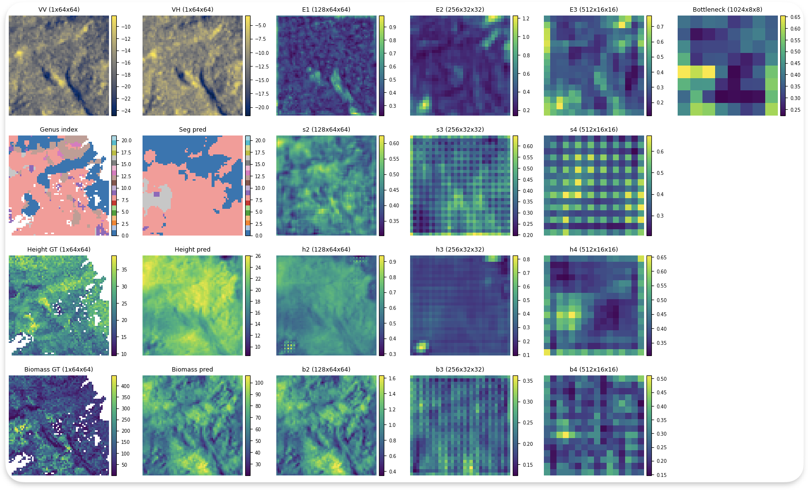

**Figure 4.11: Layer-wise representation analysis across decoder depths.** Visualization of how task-specific representations evolve from the shared bottleneck through decoder layers, showing progressive specialization for each task while maintaining alignment for related tasks (height and biomass).

# 5. Discussion and Conclusion

This chapter discusses the experimental findings from Chapter 4, connecting them back to the research questions introduced in Chapter 1. The experiments investigated multitask learning for forest attribute estimation from Sentinel-1 SAR imagery using two datasets: TreeSatAI-CHM for exploring fundamental multitask learning challenges, and iMAESTRO for testing physics-aware deep learning with allometric constraints.

## 5.1 Answering the Research Questions

**Question 1: Dataset Extension and Quality**

The TreeSatAI benchmark was successfully extended with canopy height labels by deriving them from official German LiDAR elevation products. The process involved generating canopy height models from digital terrain and surface models, aligning them to the TreeSatAI patch grid, and combining height data with Sentinel-1 backscatter bands. The resulting TreeSatAI-CHM dataset maintains the spatial coverage and species labels of the original benchmark while adding pixel-level height annotations.

The quality of derived height labels was validated through multiple checks. Negative CHM values were removed, extreme values were clipped to the 95th percentile, and the height distribution was compared against expected ranges for German forests. Additional experiments using Sentinel-2 optical imagery achieved substantially better performance (32.8% classification accuracy, 5.78 m RMSE for height), confirming the dataset contains learnable patterns and that modest SAR performance reflects the information content of radar backscatter rather than data quality issues.

**Question 2: Feature Learning in Shared Architectures**

The gradient and representation analyses show how shared encoder architectures learn features for multiple tasks. Early encoder layers learn low-level features like edges and textures that are mostly shared across tasks, though occasional conflicts arise when tasks have different requirements. Middle encoder layers learn mid-level features related to forest structure that show moderate task alignment. The bottleneck learns abstract semantic representations that are strongly shared across related tasks.

Task-specific decoders progressively refine these shared representations. The CKA analysis in iMAESTRO shows decreasing similarity from bottleneck to output, indicating gradual specialization. However, the sustained high similarity between height and biomass decoders shows that related tasks maintain aligned representations throughout the decoder pathway when coupled by physics-aware constraints.

**Question 3: Gradient Conflicts and Management**

Gradient cosine similarity analysis reveals that conflicts primarily occur in early encoder layers during initial training epochs. These conflicts reflect competing requirements for low-level feature extraction—classification benefits from edge-preserving features, while regression may benefit from smoothing features that suppress speckle noise.

As training progresses, gradient alignment improves, particularly in deeper layers. The bottleneck shows the strongest positive alignment, indicating tasks agree on high-level semantic features. Task-specific learning rates in TreeSatAI-CHM and uncertainty weighting in iMAESTRO successfully balance competing objectives. The height-biomass task pair in iMAESTRO shows particularly strong gradient alignment, demonstrating that physics-aware constraints can reduce gradient conflicts by guiding tasks toward compatible feature learning objectives.

**Question 4: Multitask vs Single-Task Performance**

Multitask learning achieves comparable or slightly improved performance compared to single-task baselines in both datasets:

- TreeSatAI-CHM: Classification F1 improves from 12.61% to 12.82%, while regression maintains similar performance (R² = 0.033 vs 0.042 baseline).
- iMAESTRO: Height R² improves from 0.255 to 0.265 (+3.7%), biomass R² improves from 0.024 to 0.039 (+62.5% relative).

The improvements are modest but consistent. The lack of substantial improvement reflects fundamental limitations of C-band SAR for these tasks rather than failures of multitask learning. The TreeSatAI-CHM dataset has small patch size (6×6 pixels) limiting learnable patterns, while iMAESTRO faces SAR saturation issues for high biomass estimation.

Multitask learning provides important benefits beyond raw performance metrics. A single shared encoder serves multiple tasks, reducing parameters and inference time compared to separate single-task models. The shared encoder provides implicit regularization by preventing overfitting to any single task. Physics-aware constraints ensure predictions respect known ecological relationships, improving reliability even when absolute accuracy is limited.

**Question 5: Parameter Sharing Strategies**

Three parameter sharing strategies were compared through ablation studies on TreeSatAI-CHM: hard sharing (MultiTaskUNet), cross-stitch networks, and cross-attention. The results show distinct behavioral patterns:

- MultiTaskUNet (hard sharing): 8.15% OA, R² = 0.033. Simple architecture with maximum parameter sharing.
- Cross-Stitch: 5.81% OA, R² = 0.037. Weaker classification but slightly better regression. The doubled parameter count may contribute to overfitting with limited training data.
- Cross-Attention: 5.19% OA, R² = 0.044. Best regression performance but weakest classification. The attention mechanism favors regression-relevant information flow.

For this dataset with small patch size and limited training data, the simpler hard-sharing architecture provides a reasonable balance between tasks. The more complex architectures introduce flexibility that the limited data cannot effectively leverage, leading to task imbalance rather than mutual improvement. For future work with larger datasets or higher-resolution inputs, cross-stitch or cross-attention architectures may prove more effective.

**Question 6: Physics-Aware Constraints**

The allometric constraint in iMAESTRO successfully couples height and biomass prediction. The sustained high gradient alignment (cosine similarity 0.4-0.9) and CKA similarity (0.64-0.81 across all decoder layers) provide evidence that the constraint guides feature learning toward consistent, plausible predictions. While the absolute performance improvement is modest, the constraint helps the model learn more structured predictions that respect known ecological relationships between height and biomass.

## 5.2 Key Findings from Both Datasets

The two datasets provided complementary insights into multitask learning for forest attribute estimation from SAR imagery.

**TreeSatAI-CHM Findings.** The TreeSatAI-CHM experiments demonstrate that multitask learning is feasible for combining classification and regression from SAR data, despite loss scale mismatches and occasional gradient conflicts. Task-specific learning rates effectively balance competing objectives. The gradient analysis provides insight into where tasks align (deeper layers) and conflict (early layers). The ablation study comparing hard sharing, cross-stitch networks, and cross-attention shows that simpler architectures work better with limited training data.

The results reveal an asymmetric relationship between tasks. The regression task shows stable performance in multitask learning, suggesting classification-driven features provide useful representations for height estimation. The classification task maintains comparable performance to its baseline, indicating the shared encoder does not substantially harm species discrimination. However, the lack of improvement suggests limited positive transfer from regression to classification.

**iMAESTRO Findings.** The iMAESTRO experiments demonstrate that multitask learning with physics-aware constraints can leverage ecological relationships to improve feature learning. The gradient and CKA analyses provide clear evidence of how tasks interact in the shared encoder and where specialization occurs in task-specific decoders. The allometric constraint successfully couples height and biomass prediction, leading to more consistent predictions that respect domain knowledge.

Height and biomass tasks show strong alignment throughout training in both gradient direction and learned representations. Segmentation shows weaker alignment with both regression tasks, particularly with biomass, suggesting genus classification requires different features than continuous attribute estimation. However, moderate alignment with height indicates some shared benefit from structural features.

**Common Patterns.** Both datasets reveal loss scale mismatch as a primary challenge. Task-specific learning rates (TreeSatAI-CHM) and uncertainty weighting (iMAESTRO) effectively address this issue. Gradient analysis shows that tasks generally align in deeper layers while experiencing occasional conflicts in early layers. Multitask learning achieves comparable or slightly improved performance compared to single-task baselines in both datasets, with the shared encoder providing regularization benefits without substantial negative transfer.

## 5.3 Challenges and Limitations

**Loss Scale Mismatch.** The primary challenge in multitask learning is balancing tasks with different loss scales. Classification losses (binary cross-entropy) and regression losses (RMSE) operate on different scales, creating optimization difficulties. Task-specific learning rates and uncertainty weighting address this issue, but require careful tuning or additional learnable parameters.

**Task Asymmetry.** The experiments reveal asymmetric relationships between tasks. Regression tasks benefit more from shared encoders than classification tasks. This may reflect the continuous nature of regression providing stronger regularization signals, or the patch-level vs pixel-level output granularity affecting gradient contributions. In TreeSatAI-CHM, the classification task operates at patch level (one prediction per 6×6 patch), while regression operates at pixel level (36 predictions per patch), meaning regression contributes more gradient signal per sample.

**Data Limitations.** Both datasets face inherent limitations. TreeSatAI-CHM has small patch size (6×6 pixels) limiting spatial context, while iMAESTRO lacks official verification and faces C-band SAR saturation for high biomass. These limitations constrain absolute performance regardless of the learning approach. C-band SAR has inherent limitations for species classification and high biomass estimation that no learning approach can fully overcome.

**Negative Transfer Risk.** While the experiments show minimal negative transfer, the risk remains when tasks have conflicting feature requirements. The gradient analysis reveals occasional negative cosine similarities, particularly between segmentation and biomass tasks in iMAESTRO, indicating potential for harmful interference.

## 5.4 Main Contributions

This thesis makes several contributions to multitask learning for forest monitoring:

**Dataset Extension.** Extended the TreeSatAI benchmark with canopy height labels derived from official German LiDAR elevation products, creating TreeSatAI-CHM for multitask learning research. The dataset maintains the spatial coverage and species labels of the original benchmark while adding pixel-level height annotations.

**Multitask Architectures.** Developed multitask architectures for joint species classification and height regression from Sentinel-1 SAR imagery. The MultiTaskUNet with shared encoder and task-specific decoders provides a baseline for multitask learning on SAR data.

**Task Interaction Analysis.** Conducted systematic analysis of gradient conflicts and feature learning in shared encoder architectures using gradient cosine similarity and centered kernel alignment. These analyses reveal where tasks align (deeper layers) and conflict (early layers), providing quantitative evidence of task interactions.

**Parameter Sharing Comparison.** Compared three parameter sharing strategies (hard sharing, cross-stitch networks, cross-attention) through ablation studies. The results show that simpler architectures work better with limited training data, while more complex architectures may prove effective with larger datasets.

**Physics-Aware Learning.** Demonstrated physics-aware multitask learning by incorporating allometric constraints linking canopy height and biomass. The sustained high gradient alignment and CKA similarity between height and biomass tasks provide evidence that physics-aware constraints guide feature learning toward consistent, plausible predictions.

**Practical Feasibility.** The experiments demonstrate that multitask learning is practically feasible for forest attribute estimation from SAR imagery, despite challenges like loss scale mismatch and occasional gradient conflicts. The comparable performance to baselines with improved computational efficiency makes multitask learning a viable approach for operational applications.

## 5.5 Future Directions

**Architectural Improvements.** The gradient analysis suggests that allowing task-specific specialization in early layers while maintaining sharing in deeper layers could reduce conflicts. Architectures like cross-stitch networks or progressive layer sharing could be explored with larger datasets.

**Enhanced Physics-Aware Constraints.** The allometric constraint successfully couples height and biomass, but additional ecological relationships could be incorporated. For example, genus-specific allometric equations could provide stronger supervision than the generic equation used here.

**Multi-Sensor Fusion.** The limited performance with C-band SAR alone suggests that incorporating additional sensors (L-band SAR for biomass, optical imagery for species classification) could substantially improve results. Multitask learning provides a natural framework for multi-sensor fusion, with different sensors contributing to different tasks.

**Larger Datasets.** Both experiments were constrained by limited training data. Larger datasets with more diverse forest types and conditions would enable more robust multitask learning and better generalization. The computational efficiency of multitask learning becomes more valuable at scale.

## 5.6 Concluding Remarks

This thesis investigated multitask learning for forest attribute estimation from Sentinel-1 SAR imagery. The research addressed six questions about dataset extension, feature learning, gradient conflicts, performance comparison, parameter sharing strategies, and physics-aware constraints. The experiments used two datasets: TreeSatAI-CHM for exploring fundamental multitask learning challenges, and iMAESTRO for testing physics-aware deep learning with allometric constraints.

The main findings show that multitask learning is feasible for forest attribute estimation from SAR imagery. While absolute performance improvements over single-task baselines are modest, multitask learning provides computational efficiency, regularization benefits, and the ability to incorporate physics-aware constraints. The gradient and representation analyses reveal how shared architectures learn hierarchical features, with low-level features shared across tasks and high-level features progressively specialized.

The TreeSatAI-CHM experiments demonstrate that multitask learning can combine classification and regression from SAR data, despite loss scale mismatches and occasional gradient conflicts. Task-specific learning rates effectively balance competing objectives. The ablation study shows that simpler architectures work better with limited training data. The iMAESTRO experiments demonstrate that physics-aware constraints can leverage ecological relationships to improve feature learning, with the allometric constraint successfully coupling height and biomass prediction.

The challenges identified—loss scale mismatch, task asymmetry, and data limitations—are not insurmountable. Task-specific learning rates, uncertainty weighting, and physics-aware constraints provide effective solutions. The insights from gradient and representation analyses inform future architectural decisions and demonstrate the value of quantitative analysis tools for understanding multitask learning dynamics.

The modest performance improvements reflect fundamental limitations of the data and sensors rather than failures of the multitask learning approach. C-band SAR has inherent limitations for species classification and high biomass estimation that no learning approach can fully overcome. However, multitask learning maximizes the information extracted from available data while maintaining computational efficiency and prediction consistency.

For operational forest monitoring applications, multitask learning offers a practical solution for estimating multiple forest attributes from a single model. The computational efficiency and regularization benefits make it particularly attractive for large-scale applications where deploying multiple single-task models would be prohibitive. The ability to incorporate physics-aware constraints ensures predictions respect known ecological relationships, improving reliability for decision-making.

## References

Caruana, R. (1997). Multitask learning. Machine Learning, 28(1), 41-75.

Kendall, A., Gal, Y., & Cipolla, R. (2018). Multi-task learning using uncertainty to weigh losses for scene geometry and semantics. In Proceedings of the IEEE Conference on Computer Vision and Pattern Recognition, pp. 7482-7491.

Misra, I., Shrivastava, A., Gupta, A., & Hebert, M. (2016). Cross-stitch networks for multi-task learning. In Proceedings of the IEEE Conference on Computer Vision and Pattern Recognition, pp. 3994-4003.

Ruder, S. (2017). An overview of multi-task learning in deep neural networks. arXiv preprint arXiv:1706.05098.

Vandenhende, S., Georgoulis, S., Van Gansbeke, W., Proesmans, M., Dai, D., & Van Gool, L. (2021). Multi-task learning for dense prediction tasks: A survey. IEEE Transactions on Pattern Analysis and Machine Intelligence, 44(7), 3614-3633.

Yu, T., Kumar, S., Gupta, A., Levine, S., Hausman, K., & Finn, C. (2020). Gradient surgery for multi-task learning. In Advances in Neural Information Processing Systems, 33, 5824-5836.

Kornblith, S., Norouzi, M., Lee, H., & Hinton, G. (2019). Similarity of neural network representations revisited. In International Conference on Machine Learning, pp. 3519-3529. PMLR.

Liu, S., James, S., Davison, A. J., & Johns, E. (2022). Auto-lambda: Disentangling dynamic task relationships. Transactions on Machine Learning Research.

Guo, M., Haque, A., Huang, D. A., Yeung, S., & Fei-Fei, L. (2023). Dynamic task prioritization for multitask learning. In European Conference on Computer Vision, pp. 270-287. Springer.

Nguyen, T., Raghu, M., & Kornblith, S. (2021). Do wide and deep networks learn the same things? Uncovering how neural network representations vary with width and depth. In International Conference on Learning Representations.

Deng, Z., Kang, B., & Berg-Kirkpatrick, T. (2023). An analysis of the effects of decoupled representation learning in multi-task learning. In Proceedings of the 61st Annual Meeting of the Association for Computational Linguistics, pp. 8542-8558.
