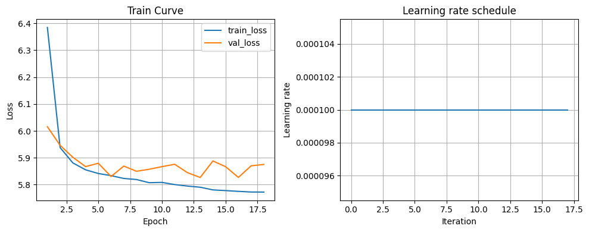
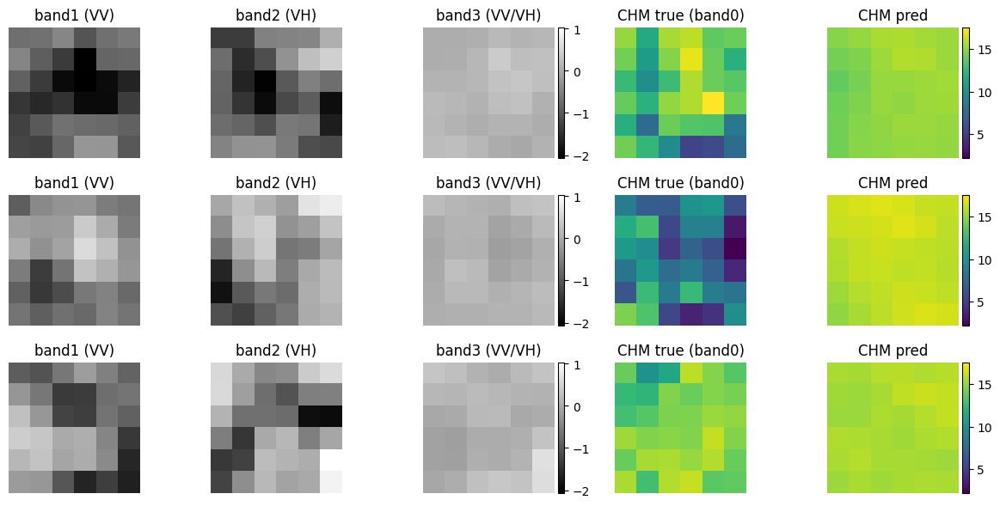
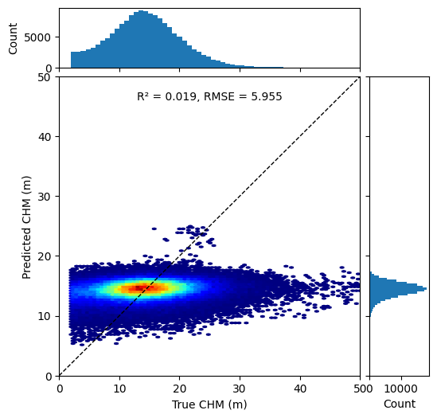
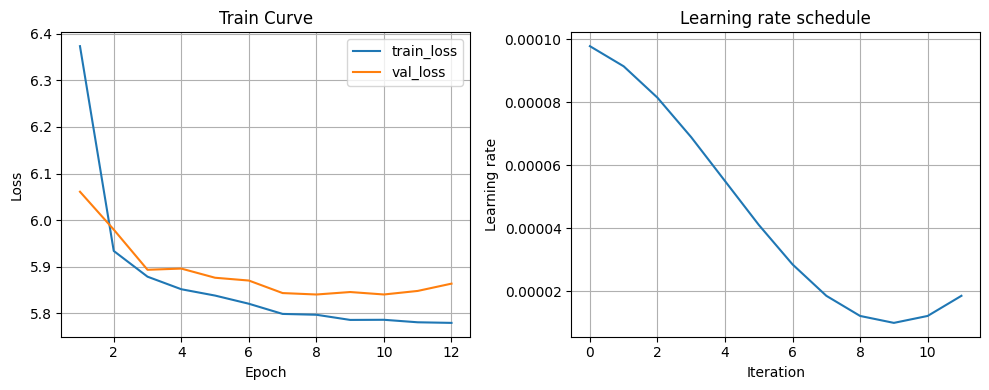
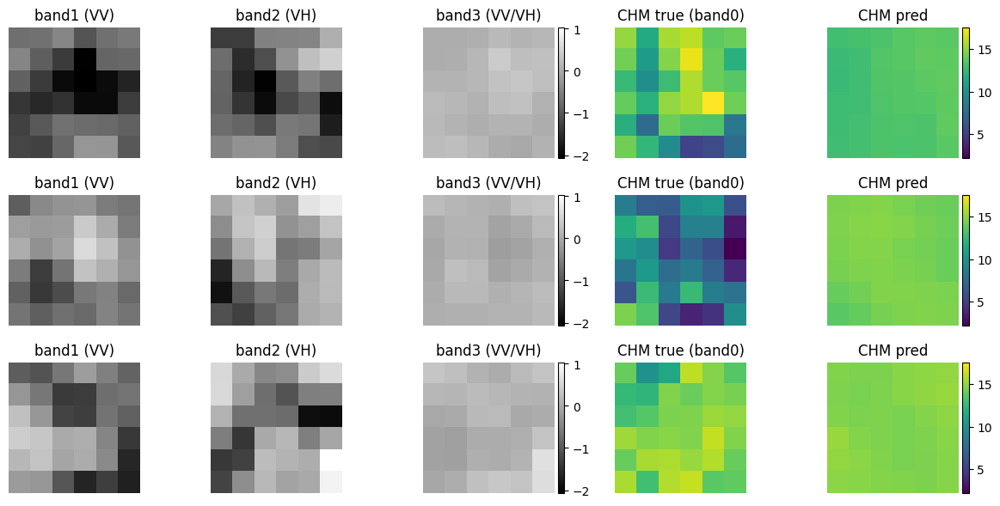
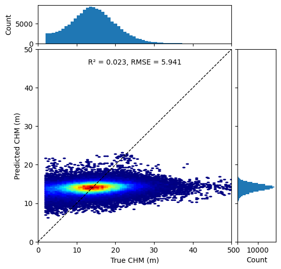

# Experiment Log – MTL-UNet / MultiTaskTreeNet

---

## 0. Metadata

- **Experiment ID**: `mtl_unet_YYYYMMDD_xxx`
- **Date**: 
- **Researcher**: 
- **Code version**: (git commit / branch / tag)
- **Script / Notebook**: [model_mtl/mtl_unet.py](cci:7://file:///Users/siyux1927/local/thesis0926/model_mtl/mtl_unet.py:0:0-0:0) + (train script)
- **Dataset version**: (e.g. `treesat_60m_stra_vX`)
- **Notes**: (one-line summary of experiment)

---

## 1. Objectives

- **Primary goal**:  
  Compare UNet-style convolutional models and simple multilayer perceptrons (MLPs) on Sentinel‑1 6×6 patches for (i) multi-label forest classification and (ii) CHM regression, with a focus on understanding why the current UNet baseline underperforms on CHM.

- **Secondary goals**:  
  - Establish strong MLP baselines that ignore explicit spatial structure but operate on flattened S1 patches.
  - Quantify how much performance is lost (or gained) when replacing a spatial UNet encoder by a purely dense MLP for classification and for CHM regression.
  - Diagnose whether poor CHM performance is primarily due to architectural choices (UNet) or to data issues (noise, saturation, outliers).

- **Hypotheses**:  
  - An MLP on normalized 3×6×6 S1 patches can achieve classification performance comparable to UNet, because the spatial footprint is very small and much of the signal may be captured by bandwise statistics.  
  - For CHM regression, if the MLP matches or improves on UNet, this suggests that UNet’s spatial inductive bias is not the main bottleneck; if it performs clearly worse, the spatial modeling in UNet remains necessary.  
  - Training classification and regression **separately** (dedicated MLPs) provides cleaner diagnostics of each task and reduces the risk of negative transfer that can occur in joint multi-task training.

---

## 2. Pre-research / Background

- **Related experiments / baselines**:
  - `mtl_unet_base`: shared UNet encoder with classification + CHM decoders, uncertainty-weighted loss.
  - `mlp_s1_patch_clf`: single-task MLP classifier on flattened S1 6×6 patches (VV, VH, VV/VH).
  - `mlp_s1_patch_reg`: single-task MLP regressor mapping the same S1 patches to a 6×6 CHM map.
  - `mlp_s1_patch_multi`: shared MLP trunk with two heads (classification logits and CHM map), trained with uncertainty-weighted multi-task loss.

- **Key design choices from literature or prior work**:
  - Shared encoder-decoder architectures such as UNet provide strong spatial inductive biases for small patches, but may be harder to optimize for noisy CHM regression.
  - MLPs on rich patch-level features have been shown to be competitive baselines in remote sensing for both tree-species classification and canopy-structure retrieval when inputs are well normalized and dimensionality is moderate.
  - CHM clipping to a physical range (e.g. `[0.5, 50] m`) and masking invalid values before loss computation aims to stabilize regression and reduce the influence of outliers.
  - 对于高分辨率图像或大 patch 的 CNN/UNet 模型，**很小的 batch size（例如 2–8，甚至 4）在文献中非常常见**，主要原因是 GPU 显存限制和希望保留较大的输入尺寸；例如用于显微细胞分割的 U‑SE‑ResNet 在 Cell Tracking Challenge 中就采用了 mini‑batch size = 4（CIVA-Lab/U-SE-ResNet-for-Cell-Tracking-Challenge）。
  - 优化理论与经验研究（如 Keskar et al., *On Large-Batch Training for Deep Learning: Generalization Gap and Sharp Minima*, 2017；以及 Smith & Topin, *Super-Convergence: Very Fast Training of Neural Networks Using Large Learning Rates*, 2019）表明：**小 batch 会带来更大的梯度噪声，但往往有助于找到更平坦、泛化更好的解**。因此，在 patch 很小（6×6）且模型容量有限的场景下，使用 batch size ≈ 4 并不是为了“匹配 patch 大小”，而是一个在计算资源和优化性质之间折中的、在实践中合理且常见的选择。
  - 多标签分割和高度不平衡的数据集上，CNN/UNet 模型常被观察到出现**退化解**：网络几乎只预测背景或“全 0 标签”，训练 loss 仍然缓慢下降，但 F1、recall 等指标在训练过程中会掉到接近 0。这类现象在医学图像和遥感分割文献中都有系统分析，例如 Buda et al., *A systematic study of the class imbalance problem in convolutional neural networks*, Neural Networks, 2018；以及 Sudre et al., *Generalised Dice Loss for Highly Unbalanced Segmentations*, MICCAI, 2017，它们都强调了类不平衡和损失设计对训练稳定性的影响。
  - 更深的卷积网络（如 UNet）相比浅层 MLP，对学习率、初始化和归一化更加敏感，容易在训练早期出现 loss 与梯度的剧烈震荡。Santurkar et al., *How Does Batch Normalization Help Optimization?*, NeurIPS, 2018 指出 BatchNorm 主要通过平滑损失景观来减轻这种震荡；结合这些结果可以解释：在相同的优化超参数下，你的 UNet 比参数量更小、结构更简单的 MLP **更容易出现指标大起大落甚至暂时“归零”**，而 MLP 的训练曲线则相对平滑稳定。

- **Questions this run is meant to answer**:
  - How do simple MLP baselines on flattened S1 patches compare to UNet-based models for classification and CHM regression on the same data splits?  
  - Does training classification and regression as **separate** MLP tasks provide clearer insights into the failure modes of the UNet CHM head than a joint multi-task UNet alone?

---

## 3. TODO / Plan

- **High-level steps**
  - [ ] Prepare data & config
  - [ ] Run training
  - [ ] Run evaluation (train/val/test)
  - [ ] Generate plots (curves, t-SNE, etc.)
  - [ ] Summarize insights and decide next steps

- **Concrete tasks**
  - [ ] Set `enable_self_attention` = ...
  - [ ] Set `enable_cross_attention` = ...
  - [ ] Set `use_uncertainty_loss` / `cls_weight` / `reg_weight`
  - [ ] Log seed and all hyperparameters
  - [ ] Save metrics JSON + figures into `results/mtl_unet/...`

---

## 4. Setup

### 4.1 Data

- **Base directory**:  
  `BASE_DIR = "/content/drive/MyDrive/data/treesat_60m_stra/"` (or local equivalent)

- **Input**:
  - Source: `train_images.npy`, `val_images.npy`, `test_images.npy`
  - Shape: `(N, C, H, W)` with `C ≥ 4`, `H = 6`, `W = 6`
  - Channels used for model input: `images[:, 1:4, ...]` (3 bands)
  - Random seed: [set_seed(42)](cci:1://file:///Users/siyux1927/local/thesis0926/model_mtl/mtl_unet.py:38:0-46:42) (or new seed if different)

- **Targets**:
  - **Classification**: multi-label vectors from `*_labels.npy` (shape `(N, num_classes)`)
  - **Regression (CHM)**:
    - Source: `images[:, 0, ...]`
    - Thresholding: `CHM_MIN_THRESHOLD = 0.5`, `CHM_MAX_THRESHOLD = 50.0`
    - Invalid values set to `NaN` before loss

- **Splits**:
  - Train: `len(train_ds) = ...`
  - Val: `len(val_ds) = ...`
  - Test: `len(test_ds) = ...`

### 4.2 Model Configuration

- **Model family**:  
  Multilayer perceptron (MLP) baselines operating on flattened S1 6×6 patches instead of a convolutional UNet encoder.

- **Input representation**:
  - Input tensors: `x ∈ ℝ^{B×3×6×6}` (S1 VV, VH, VV/VH).
  - For all MLPs, the patch is flattened per sample: `x_flat = x.view(B, 3 * 6 * 6)` (108‑dimensional feature vector).

- **Architectures**:
  - `MLPClassifier`  
    - Purpose: patch-level multi-label forest classification.  
    - Structure: input 108‑D → two hidden layers of size 256 with ReLU activations and dropout, then a linear layer to `num_classes` logits `(B, num_classes)`.

  - `MLPRegressor`  
    - Purpose: CHM regression on the same S1 patch.  
    - Structure: input 108‑D → two hidden layers of size 256 with ReLU + dropout → linear layer to 36 units, reshaped to `(B, 1, 6, 6)`.  
    - Output activation: `softplus` followed by clipping to the physical CHM range `[0, CHM_PHYSICAL_MAX]`, consistent with the UNet-based models.

  - `MultiTaskMLP`  
    - Composition: reuses `MLPClassifier` and `MLPRegressor` as two independent heads that both see the same flattened S1 input.  
    - Outputs: `(logits, chm_map)` with shapes `(B, num_classes)` and `(B, 1, 6, 6)`.  
    - Multi-task loss: uncertainty-based weighting of classification and regression losses, with learnable `log_sigma_cls`, `log_sigma_reg` and task-weight bounds `[0.1, 5.0]` via `compute_total_loss` / `get_task_weights`.

- **Intention behind using MLPs and separating tasks**:
  - Replacing the convolutional UNet encoder with simple MLPs on flattened S1 patches removes strong spatial inductive biases and tests how much information is contained in per-patch S1 values alone.
  - Running **separate** MLPs for classification and regression (`MLPClassifier`, `MLPRegressor`) provides clean single-task baselines and avoids potential negative transfer effects inherent in multi-task training.
  - The multi-task MLP (`MultiTaskMLP`) reintroduces joint learning with a simpler architecture, allowing direct comparison to the UNet-based multi-task models under the same uncertainty-weighted loss framework.

- **Key hyperparameters for MLP runs**:
  - Optimizer: `AdamW`.
  - Learning rate: `max_lr = 5e-4` (no LR scheduler in the basic MLP baseline).
  - Weight decay: `1e-5`.
  - Dropout: `p = 0.1` in hidden layers of the MLP.
  - Batch size: typically `8` (reusing the UNet experiments’ default unless otherwise noted).
  - Early stopping: validation accuracy (or weighted F1) for classification, validation R² for regression; patience ≈ 10 epochs.

### 4.3 Training Hyperparameters

- **Hardware**:
  - Device: `cuda` / `cpu`
  - GPU model / RAM: ...

- **Optimization**:
  - Optimizer: AdamW（大部分 MLP / 多任务实验）。
  - Learning rate: 由 `max_lr` / `min_lr` 以及调度器共同控制。
  - Weight decay: 通常设为 `1e-5`。
  - LR schedule: 做过无调度与不同参数配置的对比实验，目前采用 `CosineAnnealingLR(T_max = total_steps // 2, eta_min = min_lr)`，相较于早期 `T_max = total_steps // 4, eta_min = base_lr` 的配置，在验证集上有明显性能提升。

- **Training details**:
  - Batch size: ...
  - # Epochs (max): ...
  - Early stopping: (metric, patience)
  - Gradient clipping: (yes/no, value)
  - Class weights / focal loss (if used): ...

- **Logging & saving**:
  - Metrics file: `.../MultiTask_s1_mtl_report.json` (or similar)
  - Checkpoints: path & naming scheme
  - Random seed(s): ...

---

## 5. Results

### 5.1 Training Dynamics

- **Summary table (final & best epoch)**:

| Metric                 | Task | Best Epoch | Train | Val   | Test |
|------------------------|------|-----------:|------:|------:|-----:|
| Loss                   | both |           |       |       |      |
| Classification loss    | cls  |           |       |       |      |
| Regression loss        | reg  |           |       |       |      |
| Macro F1               | cls  |           |       |       |      |
| R²                     | reg  |           |       |       |      |
| RMSE                   | reg  |           |       |       |      |

- **Curves**:
  - ``
  - ``  
    (w_cls, w_reg from [get_task_weights()](cci:1://file:///Users/siyux1927/local/thesis0926/model_mtl/mtl_unet.py:592:4-608:55))

### 5.2 Classification Metrics

- **Overall metrics**:

| Metric            | Train | Val  | Test |
|-------------------|------:|-----:|-----:|
| Macro F1          |       |      |      |
| Micro F1          |       |      |      |
| Weighted F1       |       |      |      |
| Precision         |       |      |      |
| Recall            |       |      |      |
| mAP (avg_prec)    |       |      |      |
| Accuracy (if any) |       |      |      |

- **Per-class F1 (Val/Test)**:

| Class ID / Name | F1 (Val) | F1 (Test) | Support (Test) |
|-----------------|---------:|----------:|----------------|
| ...             |          |           |                |

- **Confusion analysis**:
  - Multi-label confusion matrix: `multilabel_confusion_matrix`
  - Standard confusion matrix (if using single-label view)

  ``

- **PR or ROC curves (optional)**:
  - ``

### 5.3 Regression (CHM) Metrics

- **Global metrics**:

| Metric | Train | Val  | Test |
|--------|------:|-----:|-----:|
| R²     |       |      |      |
| RMSE   |       |      |      |
| MAE    |       |      |      |

- **Plots**:
  - ``
  - ``
  - ``

#### 5.3.1 Experiment: `mlpreg_chm_v1` – single-task MLPRegressor on S1 patches

- **Model**: `MLPRegressor` (see Section 4.2 for architecture details).
- **Task**: CHM-only regression on Sentinel‑1 6×6 patches (no classification head).
- **Config summary** (manual run, no scheduler):
  - `base_channels = 96` (kept for consistency with UNet configs; not used by the MLP).
  - `max_lr = 1e-4`
  - `weight_decay = 1e-5`
  - `dropout = 0.1`
  - `epochs = 100` (maximum)
  - `patience = 6` (early stopping on validation R²)
- **Test metrics (from joint plot)**:
  - R² ≈ `0.019`
  - RMSE ≈ `5.96 m`
- **Saved figures (under `src/`):**
  - Training curves (train/val loss + LR): `src/mlpreg_chm_v1_loss_lr.png`
  - Qualitative CHM patches (S1 bands + GT/pred CHM): `src/mlpreg_chm_v1_qualitative_patches.png`
  - True vs. predicted CHM joint plot (test): `src/mlpreg_chm_v1_true_vs_pred_joint.png`

#### 5.3.2 Experiment: `mlpreg_chm_v2` – single-task MLPRegressor (updated run)

- **Figures (embedded):**

  - 训练/验证损失和学习率曲线：  
  

  - CHM 质检样例（S1 通道 + GT / 预测）：  
    

  - 测试集真值 vs 预测 CHM 联合分布：  
  

#### 5.3.3 Experiment: `mlpreg_chm_v2_scheduler` – MLPRegressor with CosineAnnealingLR

- **Figures (embedded, 使用 CosineAnnealingLR 调度器，图像缩小显示)：**

  - 训练/验证损失和学习率曲线：  
    

  - CHM 质检样例（S1 通道 + GT / 预测）：  
    

  - 测试集真值 vs 预测 CHM 联合分布：  
    

### 5.4 Qualitative / Representation Analysis

- **t-SNE / feature visualization**:
  - t-SNE on penultimate features for classification:
    ``
  - Color by dominant class / vegetation type.

- **Patch examples**:
  - Input S1/S2 patch, GT labels, predicted labels, GT CHM, predicted CHM:
    ``

- **Attention maps (if inspected)**:
  - ``

### 5.5 Ablation / Comparison (optional)

- **Comparison to reference runs**:

| Exp ID           | Self-Att | Cross-Att | Loss Weighting     | Macro F1 (Val) | R² (Test) | Notes                |
|------------------|----------|----------|--------------------|----------------|-----------|----------------------|
| mtl_unet_base    | off      | off      | fixed (1.0, 0.5)   |                |           |                      |
| mtl_unet_self    | on       | off      | fixed              |                |           |                      |
| mtl_unet_cross   | on       | on       | uncertainty-based  |                |           |                      |

---

## 6. Insights & Next Steps

- **Did the hypotheses hold?**
  - ...

- **Key observations**:
  - **Classification**: (e.g. where F1 improved / degraded, which classes benefited)
  - **Regression (CHM)**: (e.g. bias in low/high CHM ranges, saturation issues)
  - **Multi-task interaction**:
    - Changes in task weights over time
    - Evidence that cross-task attention helped/hurt

- **Potential causes / diagnostics**:
  - Data issues (class imbalance, CHM outliers)
  - Model capacity (under/overfitting signs)
  - Optimization issues (learning rate, instability)

- **Actionable next steps**:
  - [ ] Try different `base_channels` / depth
  - [ ] Adjust CHM thresholds or loss for `NaN` regions
  - [ ] Tune `cls_weight` / `reg_weight` or prior on `log_sigma_*`
  - [ ] Additional attention variants or regularization
  - [ ] Design next experiment ID: `...`

---